# SuperCon 2

## Table of Contents

* [Introduction](#introduction)
* [Service](#service)
    + [Overview](#overview)
    + [Workflows](#workflows)
      + [Record reporting (flagging interface)](#record-reporting-or-flagging)
      + [Record correction](#record-correction)
    + [Getting started](#getting-started)
    + [API documentation](#api-documentation)
* [Process](#process)
    + [Scripts](#scripts)

## Introduction

SuperCon 2 is the evolution of [SuperCon](http://supercon.nims.go.jp) as database of superconductors materials.
Differently from SuperCon, SuperCon 2 has been created automatically from scientific literature on superconductor
materials research.

This repository contains:

- SuperCon 2 service, which provides the API and the interface for visualising and editing material and properties
  extracted from superconductors-related papers.
- The process to create the SuperCon 2 database from scratch,
  using [Grobid Superconductor](https://github.com/lfoppiano/grobid-superconductors) to extract materials information
  from large quantities of PDFs.

**Work in progress**

## Service

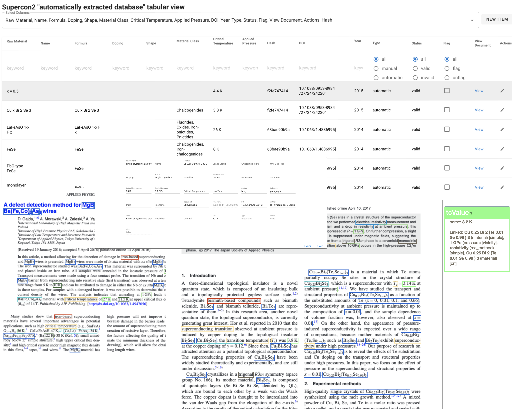

### Overview

The `supercon2` service provides the following features:

- Visualisation of materials-properties records as a table, with search/filtering, sorting, selection of non-empty values
- Visualisation of "augmented" PDFs with highlight of the annotations identifying materials and properties
- Reporting of incorrect/invalid records (**record flagging**): records can be marked as incorrect manually
- Correction of Incorrect records (**record correction**): users can correct incorrect records or add missing records.
- Automatic collection of training data: when a record has been corrected the information of the sentence, spans (the
  annotations) and tokens (the tokens, including layout information, fonts, and other perpenducular features) are
  collected

**Design principles** 
 - each document is identified by an 8-character hash code. To save space we do not allow to store multiple version of the same paper (paper with the same hash).  
 - each record is linked to the document by the document hash
 - correcting a record will generate a new record and link it to the original, so that will be possible, in future to undo modifications 

The technical details of the curation interface can be found [here](docs/correction_workflow.md).

**Terminology** 
 - **Incorrect** = wrong (e.g. 3 K extracted instead of 30K is incorrect) [Ref](https://forum.wordreference.com/threads/invalid-incorrect-wrong.2776284/post-14029941)
 - **Invalid** = wrong through being inappropriate to the situation (e.g. Tm or T curie extracted as superconducting critical temperature is invalid) [Ref](https://forum.wordreference.com/threads/invalid-incorrect-wrong.2776284/post-14029941)
 - **Flagging** = In programming, a "yes/no" indicator used to represent the current status of something. [Ref](https://www.pcmag.com/encyclopedia/term/flagging)

 
**Future plans**
 - Invalid record remove [#43](https://github.com/lfoppiano/supercon2/issues/43)
 - Undo/redo functionality: possibility to revert incorrect edits and modification of the database 
 - Versioning of documents 


[//]: # (![training-data-view.png]&#40;docs/images/training-data-view.png&#41;)
[//]: # (![pdf-view.png]&#40;docs/images/pdf-view.png&#41;)

### Interface features

Here a list of the main features, please notice that they **can all be used simultaneously**. 

#### Filtering 

By entering keywords in each column is possible to filter records by multiple filters

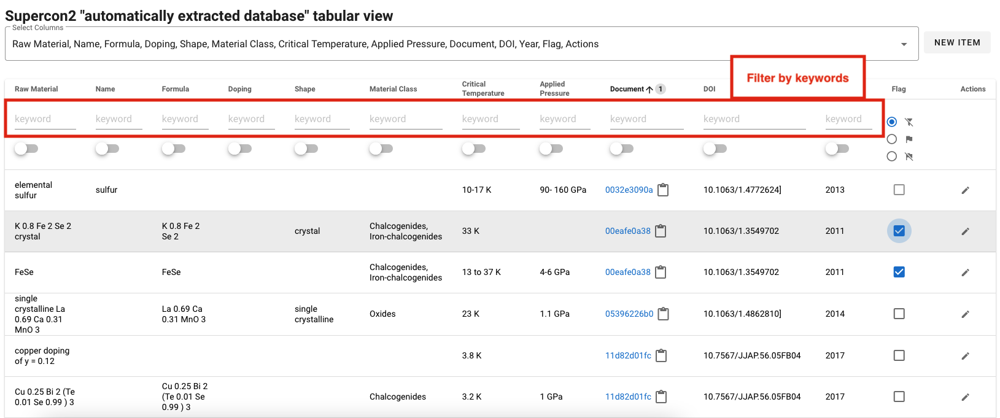

#### Filter by document
There is a shortcut for identify only records belonging to a specific document (see column Document) 

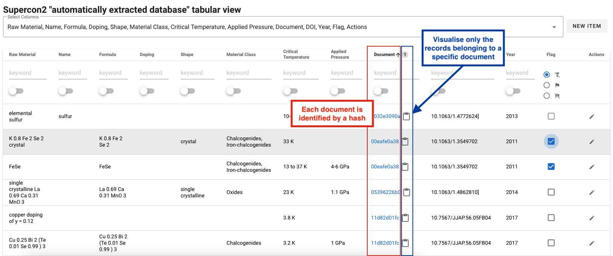

In the following figure only record of document `11d82...` are shown: 

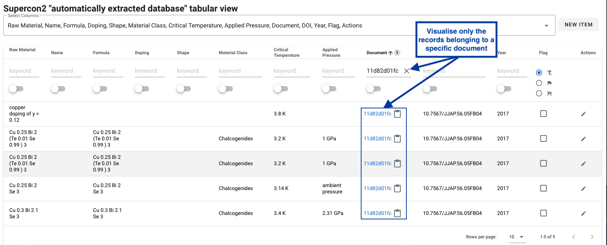


#### Change which columns to visualise

The default view does not show all the attribute of the database 

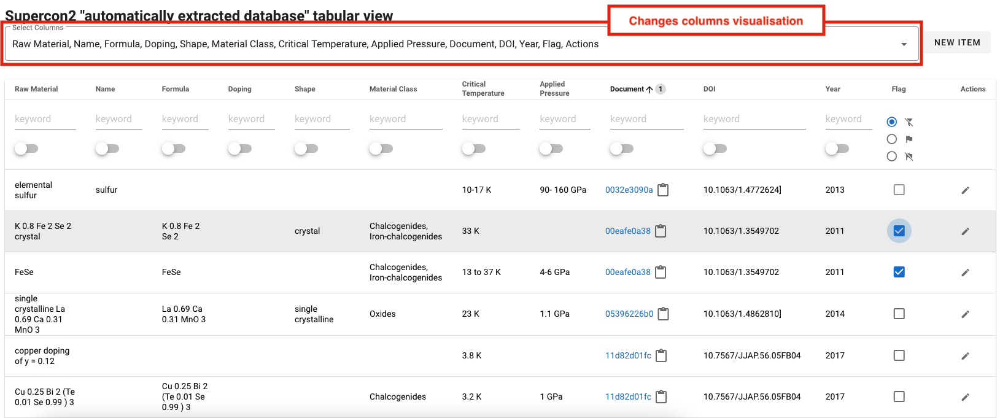

it's possible to extend the table by using the "select columns" feature:

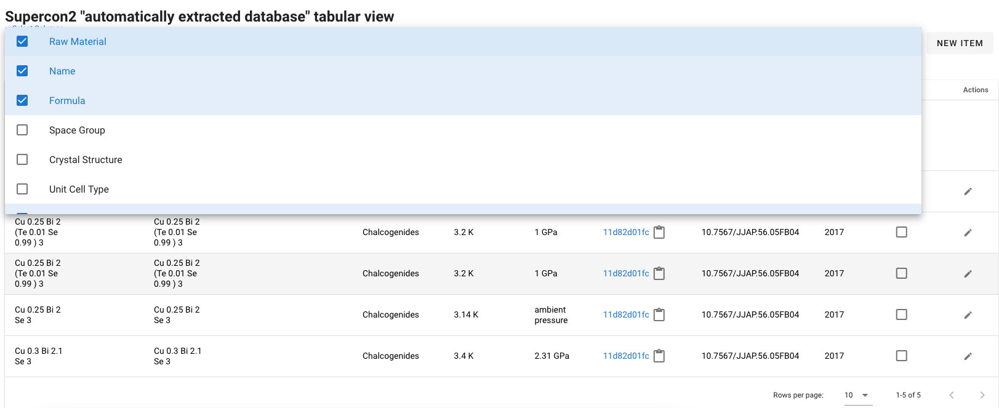

#### Hide empty/blank values 
It's possible to show only **records for which certain column(s) contains non-blank characters (spaces, break lines, tabs, etc..): 

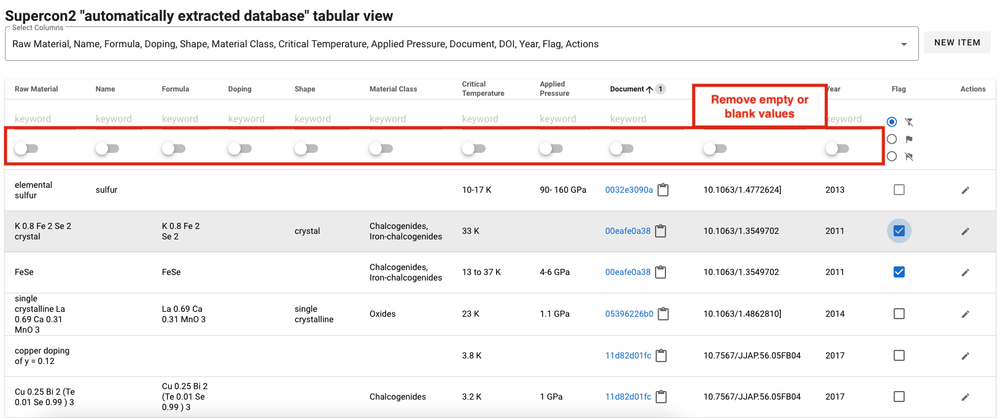
in this example the user sees only records of materials with "Applied pressure": 
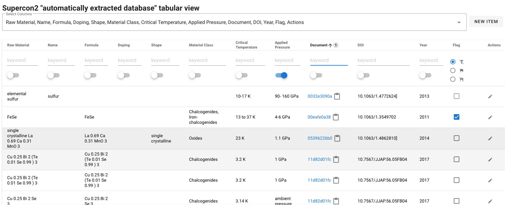

such filters can be "combined" on multiple columns (e.g. formula + applied pressure): 
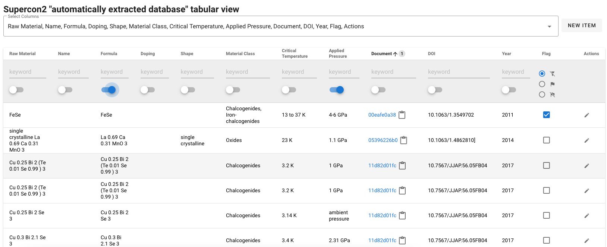

#### multi column sorting

The interface supports multicolumn sorting, the number indicate the priority, the arrow the order (ascendent or descendent): 
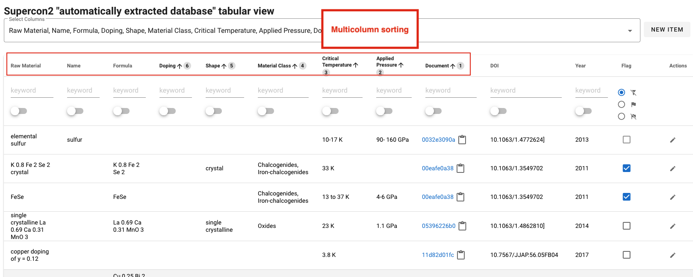

### Workflows 
#### Record reporting (or flagging)

The "Record reporting" allows users and curator to quickly report incorrect or invalid records. 
By clicking on the flagging checkbox the record is marked as invalid and can be excluded from the database without being
removed.

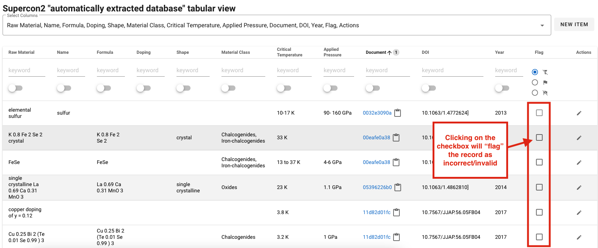

The curators have the possibility to identify such records and correct them or remove them from the database at later
stage.
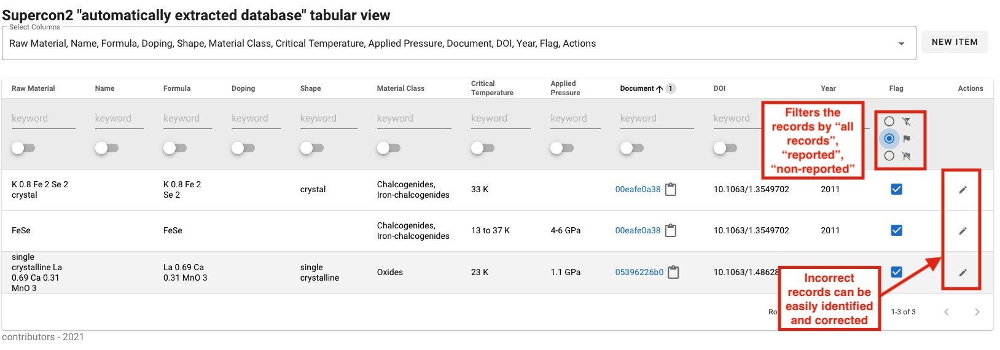

### Record correction

The interface allow the correction of records independently if they are valid or incorrect: 

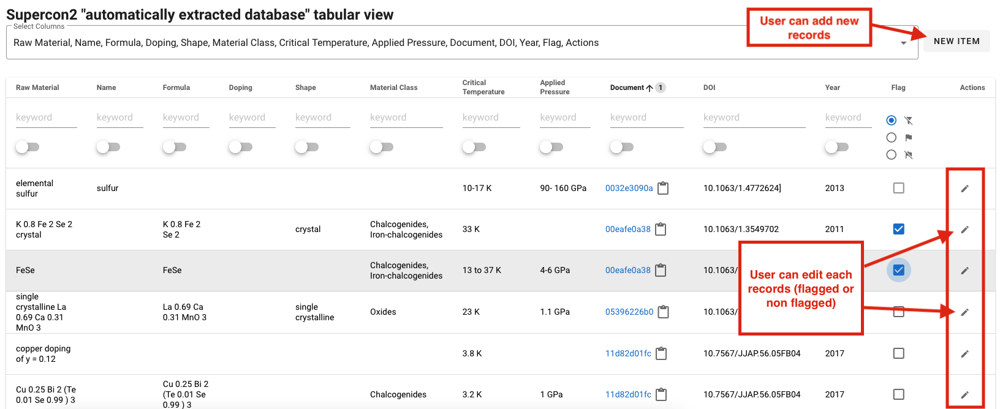

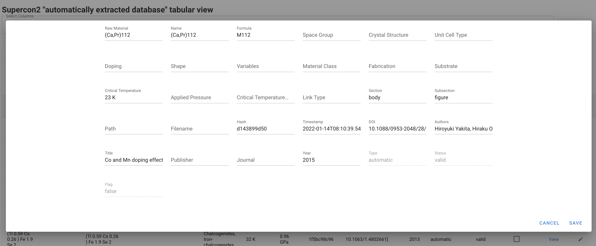

### Keystrokes

The interface can be managed entirely with the keyboard, which improves the efficiency of the curation work. 

The table can be navigated using the arrows after having selected one row with the mouse. 

The shortcuts are: 

| Key        | Description                             |
|------------|-----------------------------------------|
| n          | Open the dialog for adding a new record |
| e          | Edit the current record                 | 
| arrow-up   | move one record up                      | 
| arrow-down | move to the record down                 |
| enter      | flag/unflag the current record          | 

### Getting started

#### Docker

Docker can be built with:

> docker build -t lfoppiano/supercon2:1.2 --file Dockerfile .

and run:

> docker run -rm -p 8080 -v ./supercon2/config-docker.yaml:/opt/service/supercon2/config.yaml:ro lfoppiano/supercon2:1.2

For connecting to mongodb is possible to connect directly to the mongodb IP (to be specified in `config-docker.yaml`),
if this is not possible then it's recommended to use docker-compose.

#### Docker compose

The docker compose is going to mount the volume `resources/mongo` as `/data/db` in the container. And mapping the
mongodb container with port 27018 (to avoid conflicts with the default mongodb port).

The configuration file `supercon2/config-docker.yaml` is also mapped in the supercon2
container `/opt/service/supercon2/config.yaml`

Docker compose is executed by running:

> docker-compose up

and shut down:

> docker-compose down

#### Local development

We recommend to use CONDA
```
conda create -n supercon2 pip python=3.9
conda activate supercon2
```

check that pip is the correct one in the conda environment:

```
which pip
```

pip should be something like `....supercon2/bin/pip`. If not you should unset it with:

```
unset pip
```

Install dependencies: 

```
pip install -r requirements.txt
```

Install mongodb (the exact command will depends on the OS) 

Load sample data on the database supercon2
```
unzip resources/data/supercon_sample.zip -d resources/data

mongorestore localhost:27017/supercon_sample resources/data/supercon_sample
```
**NOTE**: make sure the `db` entry is correctly set to `supercon_sample` in `supercon2/config.yaml`,  

Finally, to run the service you can use: 

```
python -m supercon2 --config supercon2/config.yaml
```

### API documentation

The application supports custom `root_path`, which can be configured from the `config.yaml` file. All the API is served
under the custom `root_path`.

The API documentation is provided by apiflask OpenAPI (swagger) implementation.

| URL       | Description                                    |
|-----------|------------------------------------------------|
| `/spec`   | Serve the OpenAPI documentation as YAML        |
| `/redoc`  | Serve the OpenAPI documentation via redoc      |
| `/docs`   | Serve the OpenAPI documentation via swagger-UI |

Following an API documentation summary:

| URL                                  | Method     | Description                                                                      |
|--------------------------------------|------------|----------------------------------------------------------------------------------|
| `/stats`                             | GET        | Return statistics                                                                |
| `/records`                           | GET        | Return the list of records                                                       |
| `/records/<type>`                    | GET        | Return the list of records of a specific type `automatic`/`manual`               |
| `/records/<type>/<year>`             | GET        | Return the list of records of a specific type + year                             |
| `/records/<type>/<publisher>/<year>` | GET        | Return the list of records of a specific type + publisher + year                 |
| `/record/<id>`                       | GET        | Return the single record                                                         |  
| `/record/<id>`                       | PUT/PATCH  | Update the record                                                                |  
| `/record`                            | POST       | Create a new record                                                              |  
| `/record/<id>`                       | DELETE     | Remove a record by its id                                                        |  
| `/record/<id>/flags`                 | GET        | Return the flags of a single record                                              | 
| `/record/<id>/flag`                  | PATCH/PUT  | Flag a record                                                                    |  
| `/record/<id>/unflag`                | PATCH/PUT  | Unflag  a record                                                                 |   
| `/document/<hash>`                   | GET        | Load the template to show the PDF with annotations                               |
| `/annotation/<hash>`                 | GET        | Return the single document JSON representation                                   |
| `/pdf/<hash>`                        | GET        | Return the PDF document corresponding to the identifier                          |
| `/training/data/<id>`                | GET        | Get the training data by identifier                                              |
| `/training/data`                     | GET        | Get the list of all training                                                     |
| `/training/data/status/<status>`     | GET        | Get the training data by status (of the training data: new, exported, corrected) |

## Process

The processes are composed by a set of python scripts that were built under the following principles:

- versioning
- skip/force reprocessing
- simple logging (successes and failures divided by process steps)

#### Scripts

##### PDF processing and extraction

Extract superconductor materials and properties and save them on MongoDB - extraction

```
usage: supercon_batch_mongo_extraction.py [-h] --input INPUT --config CONFIG [--num-threads NUM_THREADS] [--only-new] [--database DATABASE] [--verbose]

optional arguments:
  -h, --help            show this help message and exit
  --input INPUT         Input directory
  --config CONFIG       Configuration file
  --num-threads NUM_THREADS, -n NUM_THREADS
                        Number of concurrent processes
  --only-new            Processes only documents that have not record in the database
  --database DATABASE, -db DATABASE
                        Force the database name which is normally read from the configuration file
  --verbose             Print all log information
```

Example:

```
python -m process.supercon_batch_mongo_extraction --config ./process/config.yaml --input <your_pdf_input_directory>
```

##### Conversion from document representation to material-properties records

Process extracted documents and compute the tabular format:

```
usage: supercon_batch_mongo_compute_table.py [-h] --config CONFIG [--num-threads NUM_THREADS] [--database DATABASE] [--force] [--verbose]

optional arguments:
  -h, --help            show this help message and exit
  --config CONFIG       Configuration file
  --num-threads NUM_THREADS, -n NUM_THREADS
                        Number of concurrent processes
  --database DATABASE, -db DATABASE
                        Set the database name which is normally read from the configuration file
  --force, -f           Re-process all the records and replace existing one.
  --verbose             Print all log information

```

Example:

```
python -m process.supercon_batch_mongo_compute_table --config ./process/config.yaml
```

##### Feedback manual corrections from Excel to the database

Feedback to SuperCon 2 the corrections from an Excel file

```
usage: feedback_corrections.py [-h] --corrections CORRECTIONS --config CONFIG [--dry-run] [--database DATABASE] [--verbose] [--report-file REPORT_FILE]

Feedback to SuperCon2 corrections from an Excel file

options:
  -h, --help            show this help message and exit
  --corrections CORRECTIONS
                        Correction file (csv or excel)
  --config CONFIG       Configuration file
  --dry-run             Perform the operations without writing on the database.
  --database DATABASE, -db DATABASE
                        Force the database name which is normally read from the configuration file
  --verbose             Print all log information
  --report-file REPORT_FILE
                        Dump report in a file. If the file exists it's overriden

```

Example:

```
 python -m process.feedback_corrections --config ./process/config.yaml
```


The report is a JSON file as a list of elements, each composed by 5 fields: 


```json
  {
    "id": "61e136f56e3ec3a715592989",
    "new_id": "625cf7c9e05ef9d3ccff8b5d",
    "status": "wrong",
    "action": "update",
    "hash": "48ba234393"
  }
```

The items are as follows: 
 - `id` contains the identifier of the original document 
 - `new_id` provides the new id obtained by creating a new updated record. The old record is marked as "obsolete" and linked to the new one. 
 - `status` indicate the status as provided in the excel file. Currently there are 4 main status values: `wrong`, `correct`, `invalid`, `missing`. More details [here](https://github.com/lfoppiano/supercon2/blob/feature/guidelines/docs/guidelines/guidelines.md#record-status).
 - `action`: the action that was applied on the database, usually it can be `insert` or `update` (Note: update + new_id != None => Upsert, a new record was created and the old was marked as `obsolete`)
 - `hash`: the document hash. If the record was not matching and it's inserted because marked as corrected in the Excel, the hash will be `0000000000`. 