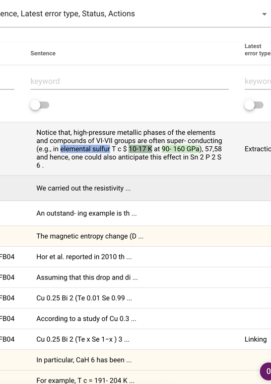
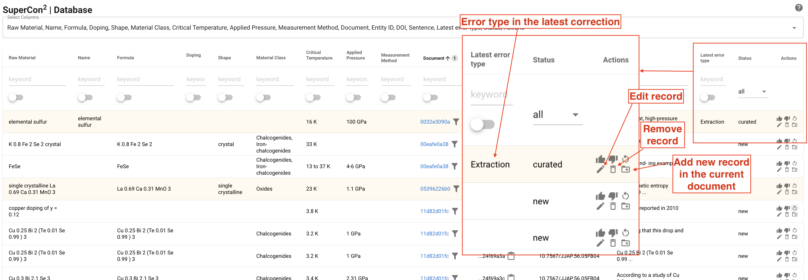
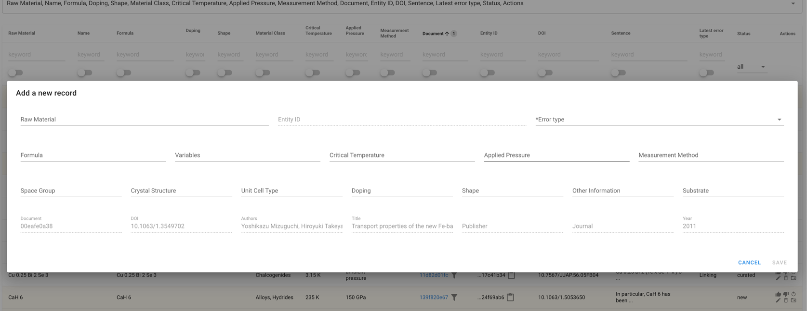
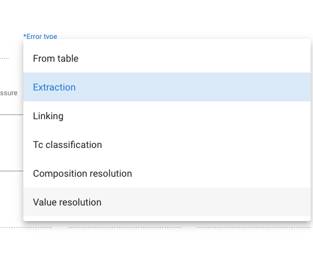

# SuperCon 2

## Table of Contents

* [Introduction](#introduction)
* [Curation interface](#curation-interface)
    + [Overview](#overview)
    + [Keystrokes](#keystrokes)
    + [Interface features](#interface-features)
    + [Workflows](#workflows)
      + [Mark records as validated/invalid](#mark-records-as-validated--invalid)
      + [Record manipulation (add, remove, edit)](#record-manipulation-editremoveadd)
      + [Training data management](#training-data-management)
    + [Getting started](#getting-started)
    + [API documentation](#api-documentation)
* [Process](#process)
    + [Scripts](#scripts)

## Introduction

SuperCon 2 is the evolution of [SuperCon](http://supercon.nims.go.jp) as database of superconductors materials.
Differently from SuperCon, SuperCon 2 has been created automatically from scientific literature on superconductor
materials research.

This repository contains:

- SuperCon 2 curation interface for visualising and editing material and properties extracted from superconductors-related papers.
- The process to create the SuperCon 2 database from scratch, using [Grobid Superconductor](https://github.com/lfoppiano/grobid-superconductors) to extract materials information from large quantities of PDFs.

**Work in progress**

## Curation interface


### Overview

The `supercon2` service provides the following features:

- Visualisation of materials-properties records as a table, with search/filtering, sorting, selection of non-empty values
- Visualisation of "augmented" PDFs with highlight of the annotations identifying materials and properties
- Reporting of invalid records (**mark as invalid**): records can be manually marked as invalid
- Records curation (**curation**): users can correct records or add missing records to existing documents.
- Automatic collection of training data: when a record has been corrected the information of the sentence, spans (the
  annotations) and tokens (the tokens, including layout information, fonts, and other features) are collected

**Design principles** 
 - each document is identified by an 8-character hash code. To save space we do not allow to store multiple version of the same paper (paper with the same hash).  
 - each record is linked to the document by the document hash
 - correcting a record will generate a new record and link it to the original, so that will be possible, in future to undo modifications or to visualise what was updated, when and how

**NOTE**: The technical details of the curation interface can be found [here](docs/data_workflow).

**Terminology** 
 - **Incorrect** = wrong (e.g. 3 K extracted instead of 30K is incorrect) [Ref](https://forum.wordreference.com/threads/invalid-incorrect-wrong.2776284/post-14029941)
 - **Invalid** = wrong through being inappropriate to the situation (e.g. Tm or T curie extracted as superconducting critical temperature is invalid) [Ref](https://forum.wordreference.com/threads/invalid-incorrect-wrong.2776284/post-14029941)

**NOTE**: Additional details on record status and error types can be found [here](docs/readme.md) 

**Future plans**
 - Undo/redo functionality: possibility to revert incorrect edits and modification of the database 
 - Document versioning
 - ...

### Keystrokes

The interface can be managed entirely with the keyboard, which improves the efficiency of the curation work. 

The table can be navigated using the arrows after having selected one row with the mouse. 

The shortcuts are: 

| Key          | Description                                                  |
|--------------|--------------------------------------------------------------|
| n            | Add new record (in the same document of the selected record) |
| e            | Edit the selected record                                     |
| ⌘ + Enter    | Save the record in the edit dialog (Mac)                     |
| Ctrl + Enter | Save the record in the edit dialog (Win)                     |
| arrow-up     | Selection up one record                                      |
| arrow-down   | Selection down one record                                    |
| enter        | Flag/unflag the selected record                              |
| ?            | Show the keyboard shortcuts dialog                           |
| esc          | Close the dialog you open                                    |

### Interface features

Here a list of the main features, please notice that they **can all be used simultaneously**. 

#### Table columns filtering 

By entering keywords in each column is possible to filter records by multiple filters


#### Filter by document

There is a shortcut for identify only records belonging to a specific document (see column Document) 


In the following figure only record of document `11d82...` are shown: 


#### Change which columns to visualise

The default view does not show all the attribute of the database 


it's possible to extend the table by using the "select columns" feature:


#### Hide empty/blank values 

It's possible to show only **records for which certain column(s) contains non-blank characters (spaces, break lines, tabs, etc..): 


in this example the user sees only records of materials with "Applied pressure": 


such filters can be "combined" on multiple columns (e.g. formula + applied pressure): 


#### Multi column sorting

The interface supports multicolumn sorting, the number indicate the priority, the arrow the order (ascendent or descendent): 


#### Annotated sentence
The annotated sentence indicate the entities related to the sentence where the record belongs.
The sentence can be expanded by clicking on top of it (the mouse cursor should change)


#### Entity-id / document-id
The document id can be used for
 - visualise only records belonging to the selected document (click on the icon near the document id)
 - open the pdf viewer (**notice that the current version of the pdf viewer is not integrated in the tabular view. Removed record in the tabular view will still be visualised in the pdf viewer.**)

The entity-id is the unique identifier for each entity. It can be expanded by clicking on it, or copied by clicking on the clipboard icon. 


### Correction workflows 

The correction workflow is summarised in the following schema: 


Records have several statuses: 
 - **new**: the record has been added by the automatic process
 - **invalid**: the record is probably wrong and it was marked manually by a curator 
 - **curated**: the record has been edited (a curated record will also contain the [error type](docs/readme.md#error-types))
 - **validated**: the record was validated by a curator as correct (this could have been done from a new or a curated record)

Additional statuses which are irrelevant for users: 
 - **obsolete**: the original record after an update (the old record is kept)
 - **removed**: the record was removed
 - **empty**: the document does not have any tabular information 

#### Mark records as validated / invalid

The "Record reporting" allows users and curator to quickly mark corrected or incorrected records. 
There is a panel of actions described in the following figure: 


The user can reset the status of a record, not the content of the record.

#### Record manipulation (edit/remove/add)

The interface allow to manipulate records with three possible actions:
 - edit record 
 - remove record
 - add new record in the same document (the bibliographic data in the edit dialog will be already filled up)



The record can be edited on the following interface:


When adding a new record, the bibligrpahic data will be pre-filled: 


In any case, in the case of any modification (edit, add, or remove) the user have to select an error type. 
This is mandatory in order to be able to save the modifications. 



#### Training data management

This section provides an overview of the collected training data. 
We follow the idea that exploiting corrections for training data is an important feature to provide improvement of the data quality and model accuracy. 
Therefore, when a record is corrected, its original sentence, tokens and annotaions are stored in a separate space and can be sent to label-studio, which is a tool for managing annotations.

The training data management looks like the following image: 


Each row represent one training item.

The `status` indicate: 
 - `new` if the training data has been added but not yet sent to label-studio
 - `in progress` if the training data was sent to label-studio 

**NOTE** if two materials within the same sentence are corrected, the sentence will appear twice in the training data management. For this reason the data shall be selectively sent to label-studio. 

The `actions` column comprises two action-buttons: 
 - `send` the training data to label-studio 
 - `remove` the training data, in case of duplicates. **In general is always better to keep the training data even if they have been sent to label-studio already**

### Getting started

#### Docker

Docker can be built with:

> docker build -t lfoppiano/supercon2:1.2 --file Dockerfile .

and run:

> docker run -rm -p 8080 -v ./supercon2/config-docker.yaml:/opt/service/supercon2/config.yaml:ro lfoppiano/supercon2:1.2

For connecting to mongodb is possible to connect directly to the mongodb IP (to be specified in `config-docker.yaml`),
if this is not possible then it's recommended to use docker-compose.

#### Docker compose

The docker compose is going to mount the volume `resources/mongo` as `/data/db` in the container. And mapping the
mongodb container with port 27018 (to avoid conflicts with the default mongodb port).

The configuration file `supercon2/config-docker.yaml` is also mapped in the supercon2
container `/opt/service/supercon2/config.yaml`

Docker compose is executed by running:

> docker-compose up

and shut down:

> docker-compose down

#### Local development

We recommend to use CONDA
```
conda create -n supercon2 pip python=3.9
conda activate supercon2
```

check that pip is the correct one in the conda environment:

```
which pip
```

pip should be something like `....supercon2/bin/pip`. If not you should unset it with:

```
unset pip
```

Install dependencies: 

```
pip install -r requirements.txt
```

Install mongodb (the exact command will depends on the OS) 

Load sample data on the database supercon2
```
unzip resources/data/supercon_sample.zip -d resources/data

mongorestore localhost:27017/supercon_sample resources/data/supercon_sample
```
**NOTE**: make sure the `db` entry is correctly set to `supercon_sample` in `supercon2/config.yaml`,  

Finally, to run the service you can use: 

```
python -m supercon2 --config supercon2/config.yaml
```

### API documentation

The application supports custom `root_path`, which can be configured from the `config.yaml` file. All the API is served
under the custom `root_path`.

The API documentation is provided by apiflask OpenAPI (swagger) implementation.

| URL       | Description                                    |
|-----------|------------------------------------------------|
| `/spec`   | Serve the OpenAPI documentation as YAML        |
| `/redoc`  | Serve the OpenAPI documentation via redoc      |
| `/docs`   | Serve the OpenAPI documentation via swagger-UI |

Following an API documentation summary:

| URL                                                     | Method     | Description                                                                      |
|---------------------------------------------------------|------------|----------------------------------------------------------------------------------|
| `/annotation/<doc_id>`                                  | GET        | Return the JSON annotation representation of a document                          |
| `/biblio/<doc_id>`                                      | GET        | Get the bibliographic data of the document by document id                        |
| `/config`                                               | GET        | Get the configuration                                                            |
| `/database`                                             | GET        | Render the database interface                                                    |
| `/database/document/<doc_id>`                           | GET        | Get the tabular data filtering by doc_id                                         |
| `/document/<doc_id>`                                    | GET        | Render the PDF viewer (PDF document + JSON annotations)                          |
| `/label/studio/project/{project_id} `                   | GET        | Get information from a label-studio project                                      |
| `/label/studio/project/{project_id}/record/{record_id}` | POST/PUT   | Send annotation task to Label studio                                             |
| `/label/studio/project/{project_id}/records`            | POST/PUT   | Send all annotation tasks to Label studio                                        |
| `/label/studio/projects  `                              | GET        | Get the list of projects from label-studio (annotation tool)                     |
| `/pdf/<doc_id>`                                         | GET        | Return the PDF document corresponding to the identifier                          |
| `/publishers`                                           | GET        | Get list of all publishers in the database                                       |
| `/record`                                               | POST       | Create a new record                                                              |  
| `/record/<record_id>`                                   | DELETE     | Remove a record by its id                                                        |  
| `/record/<record_id>`                                   | GET        | Return the single record                                                         |  
| `/record/<record_id>`                                   | PUT/PATCH  | Update the record                                                                |  
| `/record/<record_id>/mark_invalid`                      | PUT/PATCH  | Mark a record as invalid                                                         |  
| `/record/<record_id>/mark_validated`                    | PUT/PATCH  | Mark a record as validated                                                       |  
| `/record/<record_id>/reset`                             | PUT/PATCH  | Reset record status                                                              |  
| `/record/<record_id>/status`                            | GET        | Return the flags of a single record                                              | 
| `/records`                                              | GET        | Return the list of records                                                       |
| `/records/<type>`                                       | GET        | Return the list of records of a specific type `automatic`/`manual`               |
| `/records/<type>/<publisher>/<year>`                    | GET        | Return the list of records of a specific type + publisher + year                 |
| `/records/<type>/<year>`                                | GET        | Return the list of records of a specific type + year                             |
| `/stats`                                                | GET        | Return statistics                                                                |
| `/training/data`                                        | GET        | Get the list of all training data stored in the database                         |
| `/training/data/status/<status>`                        | GET        | Get the training data by status (of the training data: new, exported, corrected) |
| `/training/data/<training_data_id>`                     | GET        | Export training data                                                             |
| `/training/data/<training_data_id>`                     | DELETE     | Remove training data                                                             |
| `/training_data`                                        | GET        | Render interface for managing the training data                                  |
| `/version`                                              | GET        | Render interface for managing the training data                                  |
| `/years`                                                | GET        | Render interface for managing the training data                                  |

## Process

The processes are composed by a set of python scripts that were built under the following principles:

- versioning
- skip/force reprocessing
- simple logging (successes and failures divided by process steps)

### Scripts

#### PDF processing and extraction

Extract superconductor materials and properties and save them on MongoDB - extraction

```
usage: supercon_batch_mongo_extraction.py [-h] --input INPUT --config CONFIG [--num-threads NUM_THREADS] [--only-new] [--database DATABASE] [--verbose]

optional arguments:
  -h, --help            show this help message and exit
  --input INPUT         Input directory
  --config CONFIG       Configuration file
  --num-threads NUM_THREADS, -n NUM_THREADS
                        Number of concurrent processes
  --only-new            Processes only documents that have not record in the database
  --database DATABASE, -db DATABASE
                        Force the database name which is normally read from the configuration file
  --verbose             Print all log information
```

Example:

```
python -m process.supercon_batch_mongo_extraction --config ./process/config.yaml --input <your_pdf_input_directory>
```

#### Conversion from document representation to material-properties records

Process extracted documents and compute the tabular format:

```
usage: supercon_batch_mongo_compute_table.py [-h] --config CONFIG [--num-threads NUM_THREADS] [--database DATABASE] [--force] [--verbose]

optional arguments:
  -h, --help            show this help message and exit
  --config CONFIG       Configuration file
  --num-threads NUM_THREADS, -n NUM_THREADS
                        Number of concurrent processes
  --database DATABASE, -db DATABASE
                        Set the database name which is normally read from the configuration file
  --force, -f           Re-process all the records and replace existing one.
  --verbose             Print all log information

```

Example:

```
python -m process.supercon_batch_mongo_compute_table --config ./process/config.yaml
```

#### Feedback manual corrections from Excel to the database

Feedback to SuperCon 2 the corrections from an Excel file

```
usage: feedback_corrections.py [-h] --corrections CORRECTIONS --config CONFIG [--dry-run] [--database DATABASE] [--verbose] [--report-file REPORT_FILE]

Feedback to SuperCon2 corrections from an Excel file

options:
  -h, --help            show this help message and exit
  --corrections CORRECTIONS
                        Correction file (csv or excel)
  --config CONFIG       Configuration file
  --dry-run             Perform the operations without writing on the database.
  --database DATABASE, -db DATABASE
                        Force the database name which is normally read from the configuration file
  --verbose             Print all log information
  --report-file REPORT_FILE
                        Dump report in a file. If the file exists it's overriden

```

Example:

```
 python -m process.feedback_corrections --config ./process/config.yaml
```


The report is a JSON file as a list of elements, each composed by 5 fields: 


```json
  {
    "id": "61e136f56e3ec3a715592989",
    "new_id": "625cf7c9e05ef9d3ccff8b5d",
    "status": "wrong",
    "action": "update",
    "hash": "48ba234393"
  }
```

The items are as follows: 
 - `id` contains the identifier of the original document 
 - `new_id` provides the new id obtained by creating a new updated record. The old record is marked as "obsolete" and linked to the new one. 
 - `status` indicate the status as provided in the excel file. Currently there are 4 main status values: `wrong`, `correct`, `invalid`, `missing`. More details [here](https://github.com/lfoppiano/supercon2/blob/feature/guidelines/docs/guidelines/guidelines.md#record-status).
 - `action`: the action that was applied on the database, usually it can be `insert` or `update` (Note: update + new_id != None => Upsert, a new record was created and the old was marked as `obsolete`)
 - `hash`: the document hash. If the record was not matching and it's inserted because marked as corrected in the Excel, the hash will be `0000000000`. 