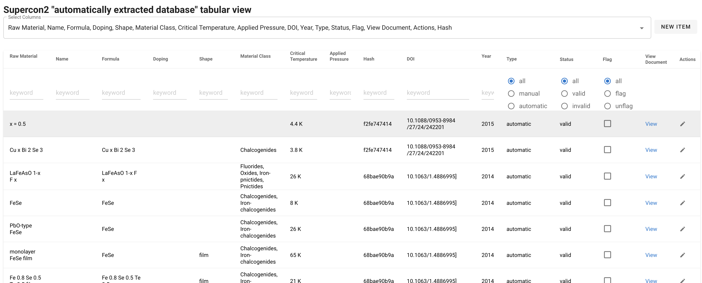

# SuperCon 2

## Table of Contents

  * [Introduction](#introduction)
  * [Service](#service)
  * [Process](#process)
    + [Scripts](#scripts)


## Introduction

SuperCon 2 is the evolution of [SuperCon](http://supercon.nims.go.jp) as database of superconductors materials. 
Differently from SuperCon, SuperCon 2 has been created automatically from scientific literature on superconductor materials research.

This repository contains: 
 - SuperCon 2 service, which provides the API and the interface for visualising and editing material and properties extracted from superconductors-related papers.
 - The process to create the SuperCon 2 database from scratch, using [Grobid Superconductor](https://github.com/lfoppiano/grobid-superconductors) to extract materials information from large quantities of PDFs.

## Service 

The `supercon2` service provides the following features: 
 - Visualisation of records of extracted materials-properties 
   

 - Visualisation of "augmented" PDFs with highlight annotations of materials and properties
   

 - Filtering by columns search

 - Flagging of invalid records: records can be marked as valid/invalid manually
   

 - Add/Edit/Remove of records.
   
 
 - Automatic collection of training data: when a record has been corrected the information of the sentence, spans (the annotations) and tokens (the tokens, including layout information, fonts, and other perpenducular features) are collected
   


### Getting started

#### Docker

Docker can be built with: 

> docker build -t lfoppiano/supercon2:1.2 --file Dockerfile .

and run: 

> docker run  -rm -p 8080 -v ./supercon2/config-docker.yaml:/opt/service/supercon2/config.yaml:ro lfoppiano/supercon2:1.2

For connecting to mongodb is possible to connect directly to the mongodb IP (to be specified in `config-docker.yaml`), if this is not possible then it's recommended to use docker-compose.

#### Docker compose

The docker compose is going to mount the volume `resources/mongo` as `/data/db` in the container. And mapping the mongodb container with port 27018 (to avoid conflicts with the default mongodb port). 

The configuration file `supercon2/config-docker.yaml` is also mapped in the supercon2 container `/opt/service/supercon2/config.yaml`

Docker compose is executed by running:  

> docker-compose up 

and shut down: 

> docker-compose down 

#### Local development

We recommend to use CONDA

```
conda create -n supercon2 pip python=3.9
conda activate supercon2
```

check that pip is the correct one in the conda environment:

```
which pip
```

pip should be something like `....supercon2/bin/pip`. If not you should unset it with: 

```
unset pip
```

To run the service you can use: 

```
python -m supercon2 --config supercon2/config.json
```

### API documentation

The application supports custom `root_path`, which can be configured from the `config.yaml` file. All the API is served under the custom `root_path`. 

The API documentation is provided by apiflask OpenAPI (swagger) implementation. 

| URL       | Description                                    |
|-----------|------------------------------------------------|
| `/spec`   | Serve the OpenAPI documentation as YAML        |
 | `/redoc`  | Serve the OpenAPI documentation via redoc      |
 | `/docs`   | Serve the OpenAPI documentation via swagger-UI |


Following a API documentation summary:

| URL                                  | Method    | Description                                                        |
|--------------------------------------|-----------|--------------------------------------------------------------------|
| `/stats`                             | GET       | Return statistics                                                  |
 | `/records`                           | GET       | Return the list of records                                         |
 | `/records/<type>`                    | GET       | Return the list of records of a specific type `automatic`/`manual` |
 | `/records/<type>/<year>`             | GET       | Return the list of records of a specific type + year               |
 | `/records/<type>/<publisher>/<year>` | GET       | Return the list of records of a specific type + publisher + year   |
| `/record/<id>`                       | GET       | Return the single record                                           |  
| `/record/flags/<id>`                 | GET       | Return the flags of a single record                                | 
| `/record/flag/<id>`                  | PATCH/PUT | Flag a record                                                      |  
| `/record/unflag/<id>`                | PATCH/PUT | Unflag  a record                                                   |   
| `/document/<hash>`                   | GET       | Load the template to show the PDF with annotations                 |
| `/annotation/<hash>`                 | GET       | Return the single document JSON representation                     |
| `/pdf/<hash>`                        | GET       | Return the PDF document corresponding to the identifier            |

## Process

The processes are composed by a set of python scripts that were built under the following principles: 
 - versioning
 - skip/force reprocessing
 - simple logging (successes and failures divided by process steps)

#### Scripts

##### PDF processing and extraction 

Extract superconductor materials and properties and save them on MongoDB - extraction

```
usage: supercon_batch_mongo_extraction.py [-h] --input INPUT --config CONFIG [--num-threads NUM_THREADS] [--only-new] [--database DATABASE] [--verbose]

optional arguments:
  -h, --help            show this help message and exit
  --input INPUT         Input directory
  --config CONFIG       Configuration file
  --num-threads NUM_THREADS, -n NUM_THREADS
                        Number of concurrent processes
  --only-new            Processes only documents that have not record in the database
  --database DATABASE, -db DATABASE
                        Force the database name which is normally read from the configuration file
  --verbose             Print all log information
```

Example: 
```
python -m process.supercon_batch_mongo_extraction --config ./process/config.yaml --input <your_pdf_input_directory>
```


##### Conversion from document representation to material-properties records

Process extracted documents and compute the tabular format: 

```
usage: supercon_batch_mongo_compute_table.py [-h] --config CONFIG [--num-threads NUM_THREADS] [--database DATABASE] [--force] [--verbose]

optional arguments:
  -h, --help            show this help message and exit
  --config CONFIG       Configuration file
  --num-threads NUM_THREADS, -n NUM_THREADS
                        Number of concurrent processes
  --database DATABASE, -db DATABASE
                        Set the database name which is normally read from the configuration file
  --force, -f           Re-process all the records and replace existing one.
  --verbose             Print all log information

```
Example: 
```
python -m process.supercon_batch_mongo_compute_table --config ./process/config.yaml
```

##### Feedback manual corrections from Excel to the database 

Feedback to supercon2 corrections from an Excel file


```
usage: feedback_corrections.py [-h] --corrections CORRECTIONS --config CONFIG [--dry-run] [--database DATABASE] [--verbose]

optional arguments:
  -h, --help            show this help message and exit
  --corrections CORRECTIONS
                        Correction file (csv or excel)
  --config CONFIG       Configuration file
  --dry-run             Perform the operations without writing on the database.
  --database DATABASE, -db DATABASE
                        Force the database name which is normally read from the configuration file
  --verbose             Print all log information

```
Example: 
```
python -m process.supercon_batch_mongo_compute_table --config ./process/config.yaml
```
