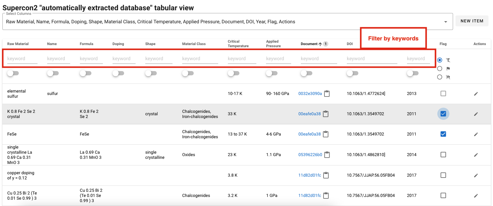
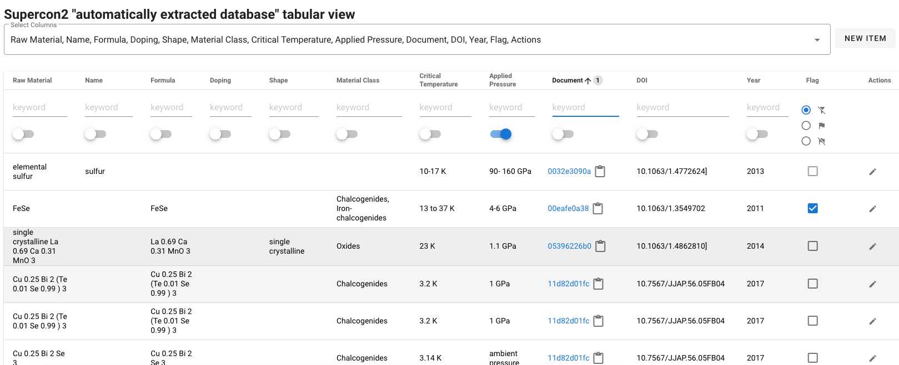
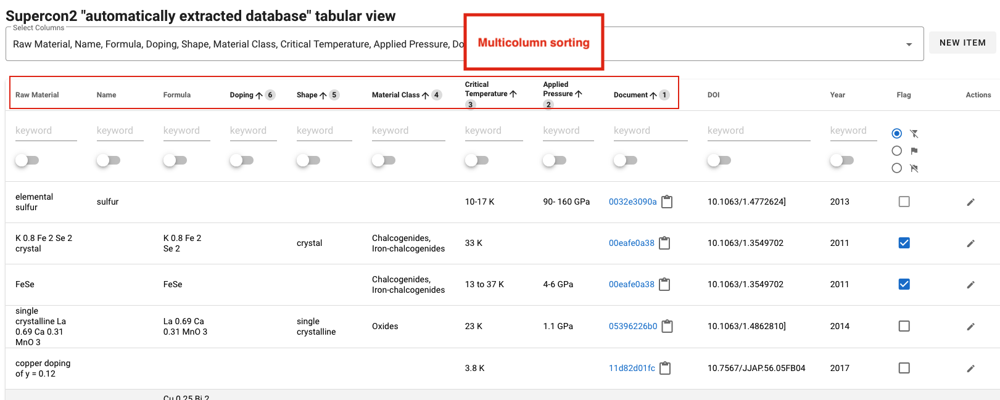
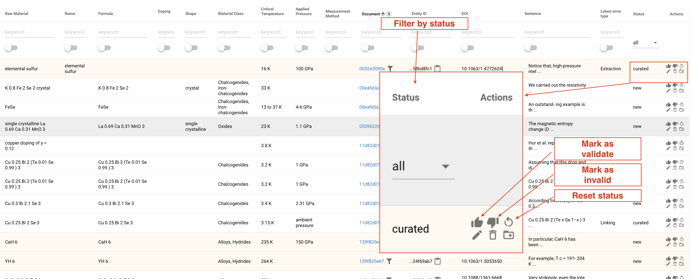

# Curation interface documentation

## Overview

The `supercon2` service provides the following features:

- Visualisation of materials-properties records as a table, with search/filtering, sorting, selection of non-empty values
- Visualisation of "augmented" PDFs with highlight of the annotations identifying materials and properties
- Reporting of invalid records (**mark as invalid**): records can be manually marked as invalid
- Records curation (**curation**): users can correct records or add missing records to existing documents.
- Automatic collection of training data: when a record has been corrected the information of the sentence, spans (the
  annotations) and tokens (the tokens, including layout information, fonts, and other features) are collected

**Design principles**
- each document is identified by an 8-character hash code. To save space we do not allow to store multiple version of the same paper (paper with the same hash).
- each record is linked to the document by the document hash
- correcting a record will generate a new record and link it to the original, so that will be possible, in future to undo modifications or to visualise what was updated, when and how

**NOTE**: The technical details of the curation interface can be found [here](docs/data_workflow).

**Terminology**
- **Incorrect** = wrong (e.g. 3 K extracted instead of 30K is incorrect) [Ref](https://forum.wordreference.com/threads/invalid-incorrect-wrong.2776284/post-14029941)
- **Invalid** = wrong through being inappropriate to the situation (e.g. Tm or T curie extracted as superconducting critical temperature is invalid) [Ref](https://forum.wordreference.com/threads/invalid-incorrect-wrong.2776284/post-14029941)

**NOTE**: Additional details on record status and error types can be found [here](docs/readme.md)

**Future plans**
- Undo/redo functionality: possibility to revert incorrect edits and modification of the database
- Document versioning
- ...

## Features

Here a list of the main features, please notice that they **can all be used simultaneously**.

### Table columns filtering

By entering keywords in each column is possible to filter records by multiple filters

### Filter by document

There is a shortcut for identify only records belonging to a specific document (see column Document)

In the following figure only record of document `11d82...` are shown:

### Change which columns to visualise

The default view does not show all the attribute of the database

it's possible to extend the table by using the "select columns" feature:

### Hide empty/blank values

It's possible to show only **records for which certain column(s) contains non-blank characters (spaces, break lines, tabs, etc..):

in this example the user sees only records of materials with "Applied pressure":

such filters can be "combined" on multiple columns (e.g. formula + applied pressure):

### Multi column sorting

The interface supports multicolumn sorting, the number indicate the priority, the arrow the order (ascendent or descendent):

### Annotated sentence
The annotated sentence indicate the entities related to the sentence where the record belongs.
The sentence can be expanded by clicking on top of it (the mouse cursor should change)

### Entity-id / document-id
The document id can be used for
- visualise only records belonging to the selected document (click on the icon near the document id)
- open the pdf viewer (**notice that the current version of the pdf viewer is not integrated in the tabular view. Removed record in the tabular view will still be visualised in the pdf viewer.**)

The entity-id is the unique identifier for each entity. It can be expanded by clicking on it, or copied by clicking on the clipboard icon.

### Mark records as validated / invalid

The "Record reporting" allows users and curator to quickly mark corrected or incorrected records.
There is a panel of actions described in the following figure:

The user can reset the status of a record, not the content of the record.

### Record manipulation (edit/remove/add)

The interface allow to manipulate records with three possible actions:
- edit record
- remove record
- add new record in the same document (the bibliographic data in the edit dialog will be already filled up)

The record can be edited on the following interface:

When adding a new record, the bibligrpahic data will be pre-filled:

In any case, in the case of any modification (edit, add, or remove) the user have to select an error type.
This is mandatory in order to be able to save the modifications.

### Look for the extracted value on the paper

You can go to the document page from the database page.

Go to the position of the material on the paper.

Find the extracted value from bulb icon.

Show the detail of the material.

## Keystrokes

The interface can be managed entirely with the keyboard, which improves the efficiency of the curation work.

The table can be navigated using the arrows after having selected one row with the mouse.

The shortcuts are:

| Key          | Description                                                  |
|--------------|--------------------------------------------------------------|
| n            | Add new record (in the same document of the selected record) |
| e            | Edit the selected record                                     |
| ⌘ + Enter    | Save the record in the edit dialog (Mac)                     |
| Ctrl + Enter | Save the record in the edit dialog (Win)                     |
| arrow-up     | Selection up one record                                      |
| arrow-down   | Selection down one record                                    |
| enter        | Flag/unflag the selected record                              |
| ?            | Show the keyboard shortcuts dialog                           |
| esc          | Close the dialog you open                                    |

