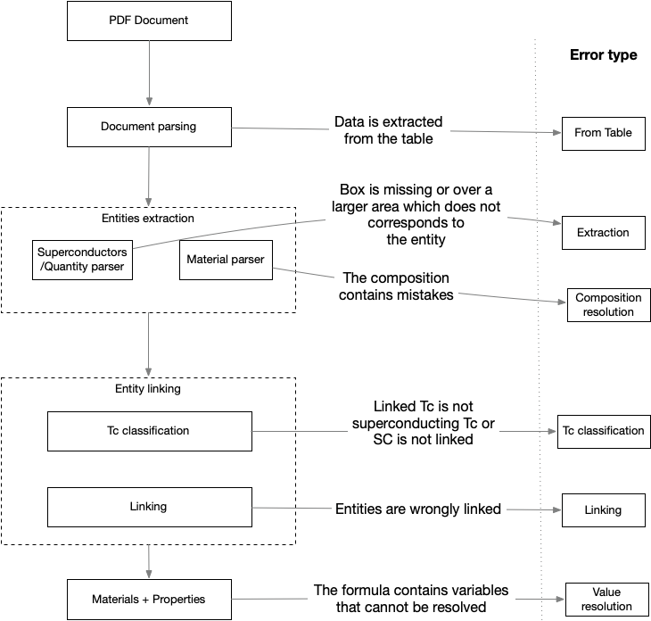

# Curation workflow

The curation workflow is summarised in the following schema:

## Workflow control

### Error types

The error types or causes for which the material-properties record is incorrect.

They answer to the question: "What was the cause?"

| Name                   | Description                                                                                                                                                                                           |
|------------------------|-------------------------------------------------------------------------------------------------------------------------------------------------------------------------------------------------------|
| From table             | The entities Material -> Tc -> Pressure is identified in a table. At the moment table extraction is not performed.                                                                                    |
| Extraction             | The material, temperature, pressure is not extracted (no box) or extracted incorrectly.                                                                                                               |                                                      
| Linking                | The material is incorrectly linked to the Tc given that the entities are correctly recognised                                                                                                         |                                                   
| Tc classification      | The temperature is not correctly classified as "superconductors critical temperature" (e.g. Curie temperature, Magnetic temperature…)                                                                 | 
| Composition resolution | The exact composition cannot be resolved (e.g. the stochiometric values cannot be resolved)                                                                                                           |
| Value resolution       | The extracted formula contains variables that cannot be resolved, even after having read the paper. This includes when data is from tables. [#125](https://github.com/lfoppiano/supercon2/issues/125) |

### Status flags

The workflows flags are properties within the database that are used to mark different status of the data:

- `type` indicate the type of operation that was performed
- `status` indicate the status of the current record

and their value is used as follows:

| Name   | Values    | Visible to users | Description                                                                                                                                         |
|--------|-----------|------------------|-----------------------------------------------------------------------------------------------------------------------------------------------------|
| type   | manual    | true             | The performed operation was manual                                                                                                                  |
| type   | automatic | true             | The performed operation was automatic (anomaly detection, loading script)                                                                           |
| status | valid     | true             | The record is valid (if `type=automatic` the record might still be wrong)                                                                           |
| status | invalid   | true             | The record is probably invalid, incorrect                                                                                                           |
| status | obsolete  | false            | The record is obsolete, a new record supersedes it and the new record will point to the old (if we assume that a correction will create new record) |
| status | new       | true             | the record has been added by the automatic process                                                                                                  |
| status | curated   | true             | the record has been edited (a curated record will also contain the [error type](docs/readme.md#error-types))                                        | 
| status | validated | true             | the record was validated by a curator as correct (this could have been done from a new or a curated record)                                         | 
| status | removed   | false            | the record was removed                                                                                                                              | 
| status | empty     | false            | the originating document does not have any extracted information                                                                                    | 

However, the flags should be used in pair and the state change is illustrate as follows:

