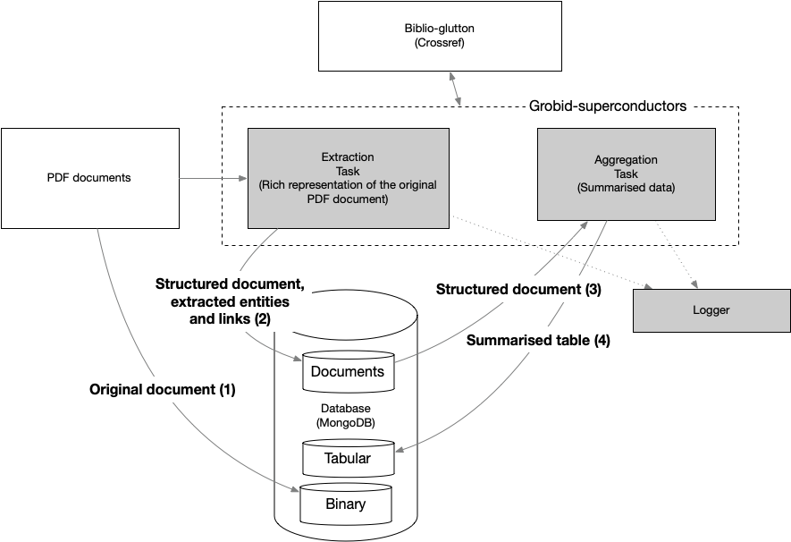
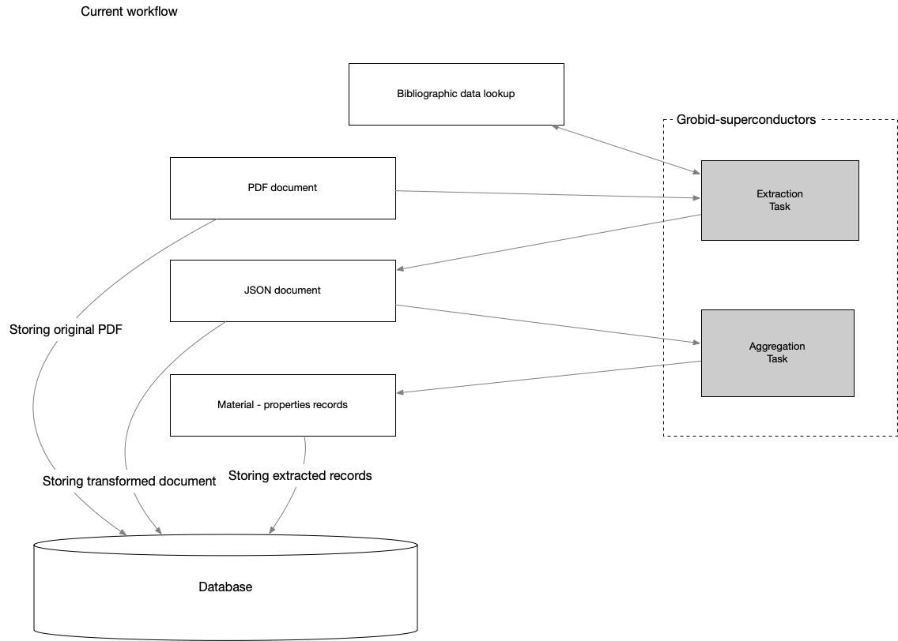
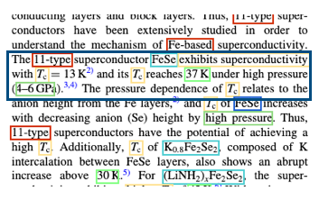
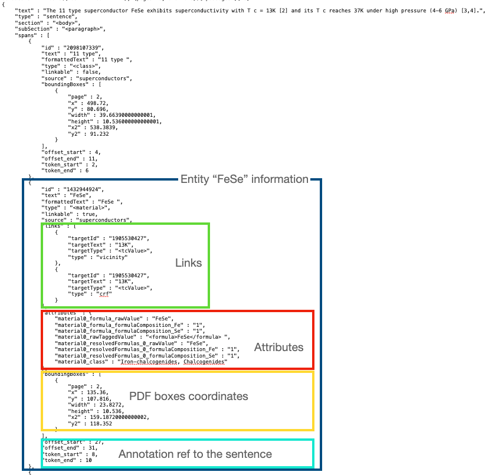
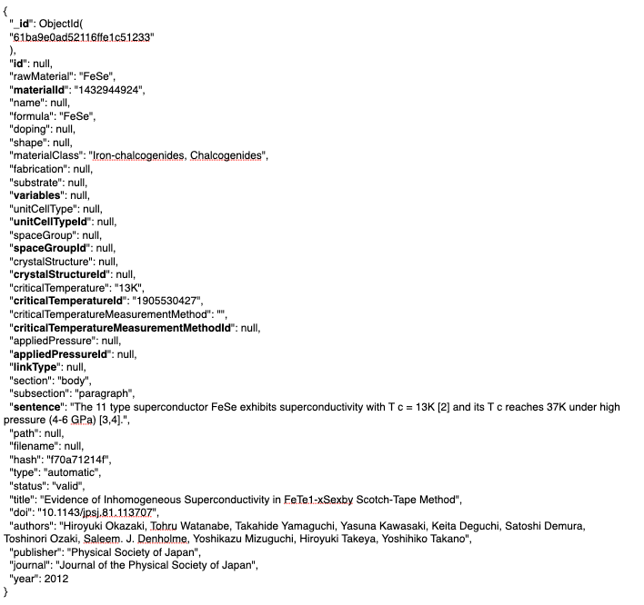
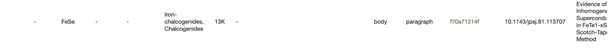
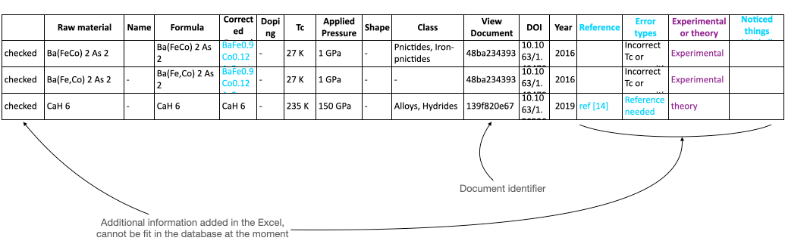
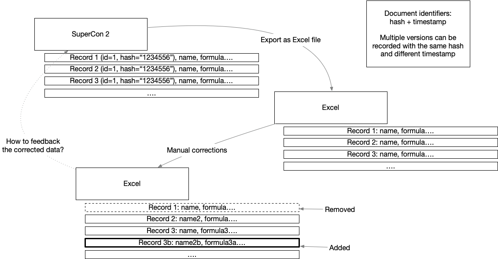

# Data ingestion processes


## Introduction

The SuperCon 2 database is currently created using a 2-steps process:



which consists in:
- Extraction task: transformation, structuring and extraction of PDF documents into text representation (2) (JSON format, stored in a 'document' collection)
- Aggregation task: summary of the extracted data (3) into a tabular synthetic representation (4) (JSON format, stored in a 'tabular' collection)
- additionally, the PDFs are also stored as binary (1)

Obviously, each step is optimised and structured to best serve its purpose:
- (2) + (1) are used to visualise the PDF and the annotations in the same page
- (3) is used to show the database

The same schema can be seen as follows, where the focus is on the data flow:




A “record”, is a row in the database table (material, properties)

## Data flow

In this section we illustrate the data flow, from the data point of view.

Let's take an example a sentence in a document (within the blue box).



The same sentence after the Extraction task, is stored as follows in the data format (2), as illustrated before. From the figure we can see that for each entity we have several information, e.g. links, attributes, coordinates within the PDF and additional information like the offsets in the sentence.



The Aggregation Task "compresses" to synthetic data, where the goal is to show the record in a tabular manner.
The various identifiers (*Id) are unique identifiers from the data format (2), e.g. material ID si the unique ID of the entities of type material.
The synthesized data become:



which is partially visualised in the next figure.
Please notice that the attributes in bold are not visualised, nor exported to Excel.



A generic Excel output (specifically taken from the Sakai-san corrected data) looks as follows.
**Please notice that this represents a different record, it's just an example to show that the export to Excel leads to loss/addition of certain data.**



In summary:



Remarks/comments:
- Excel does not export all the available data (current interface limitation), for example the specific record identifier is not exported.
- Given a record in the Excel file that Sakai-san corrected, we can identify the document but there is no guaranteed we can find the actual record.
- The process of correction can be more efficient with a single interface
- the mapping between Excel and the database might require manual intervention to find the correct record (low efficiency),
- the added data do not fit in the database at the moment,


The processes are composed by a set of python scripts that were built under the following principles:

- versioning
- skip/force reprocessing
- simple logging (successes and failures divided by process steps)


## Scripts 

### Run the ingestion process

Extract superconductor materials and properties and save them on MongoDB - extraction

```
usage: supercon_batch_mongo_extraction.py [-h] --input INPUT --config CONFIG [--num-threads NUM_THREADS] [--only-new] [--database DATABASE] [--verbose]

optional arguments:
  -h, --help            show this help message and exit
  --input INPUT         Input directory
  --config CONFIG       Configuration file
  --num-threads NUM_THREADS, -n NUM_THREADS
                        Number of concurrent processes
  --only-new            Processes only documents that have not record in the database
  --database DATABASE, -db DATABASE
                        Force the database name which is normally read from the configuration file
  --verbose             Print all log information
```

Example:

```
python -m process.supercon_batch_mongo_extraction --config ./process/config.yaml --input <your_pdf_input_directory>
```

### Conversion from document representation to material-properties records

Process extracted documents and compute the tabular format:

```
usage: supercon_batch_mongo_compute_table.py [-h] --config CONFIG [--num-threads NUM_THREADS] [--database DATABASE] [--force] [--verbose]

optional arguments:
  -h, --help            show this help message and exit
  --config CONFIG       Configuration file
  --num-threads NUM_THREADS, -n NUM_THREADS
                        Number of concurrent processes
  --database DATABASE, -db DATABASE
                        Set the database name which is normally read from the configuration file
  --force, -f           Re-process all the records and replace existing one.
  --verbose             Print all log information

```

Example:

```
python -m process.supercon_batch_mongo_compute_table --config ./process/config.yaml
```

### Feedback manual corrections from Excel to the database

Feedback to SuperCon 2 the corrections from an Excel file

```
usage: feedback_corrections.py [-h] --corrections CORRECTIONS --config CONFIG [--dry-run] [--database DATABASE] [--verbose] [--report-file REPORT_FILE]

Feedback to SuperCon2 corrections from an Excel file

options:
  -h, --help            show this help message and exit
  --corrections CORRECTIONS
                        Correction file (csv or excel)
  --config CONFIG       Configuration file
  --dry-run             Perform the operations without writing on the database.
  --database DATABASE, -db DATABASE
                        Force the database name which is normally read from the configuration file
  --verbose             Print all log information
  --report-file REPORT_FILE
                        Dump report in a file. If the file exists it's overriden

```

Example:

```
 python -m process.feedback_corrections --config ./process/config.yaml
```


The report is a JSON file as a list of elements, each composed by 5 fields:


```json
  {
    "id": "61e136f56e3ec3a715592989",
    "new_id": "625cf7c9e05ef9d3ccff8b5d",
    "status": "wrong",
    "action": "update",
    "hash": "48ba234393"
  }
```

The items are as follows:
- `id` contains the identifier of the original document
- `new_id` provides the new id obtained by creating a new updated record. The old record is marked as "obsolete" and linked to the new one.
- `status` indicate the status as provided in the excel file. Currently there are 4 main status values: `wrong`, `correct`, `invalid`, `missing`. More details [here](https://github.com/lfoppiano/supercon2/blob/feature/guidelines/docs/guidelines/guidelines.md#record-status).
- `action`: the action that was applied on the database, usually it can be `insert` or `update` (Note: update + new_id != None => Upsert, a new record was created and the old was marked as `obsolete`)
- `hash`: the document hash. If the record was not matching and it's inserted because marked as corrected in the Excel, the hash will be `0000000000`. 
