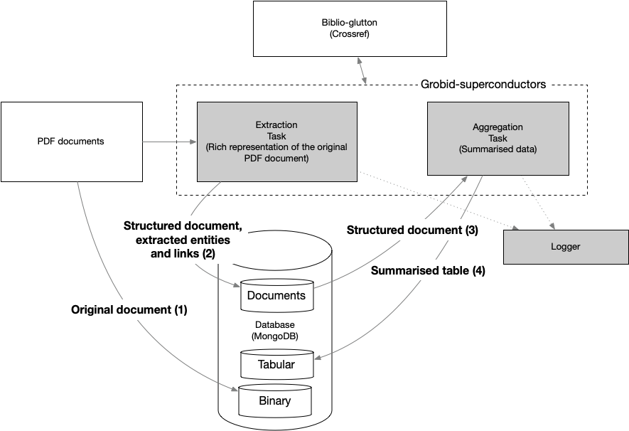
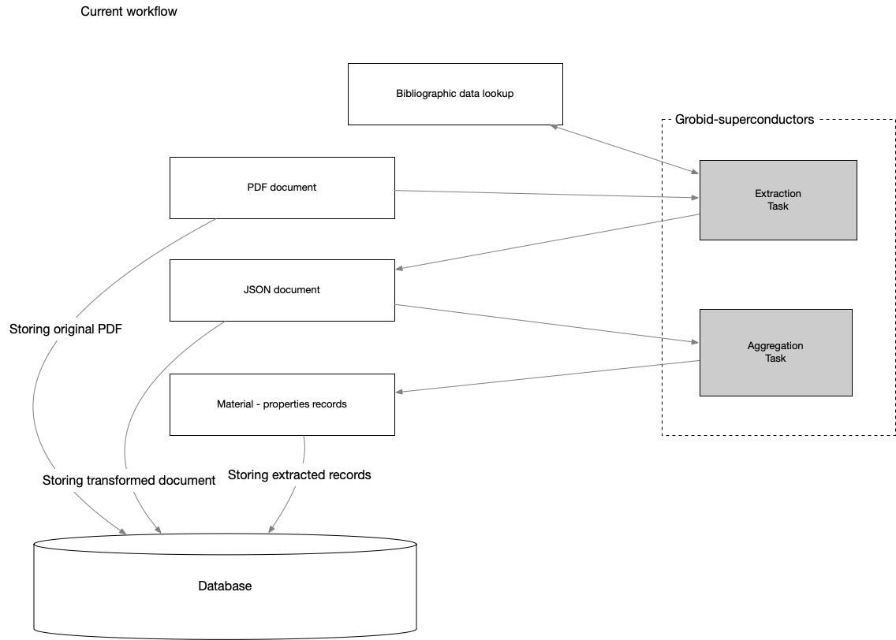
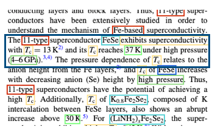
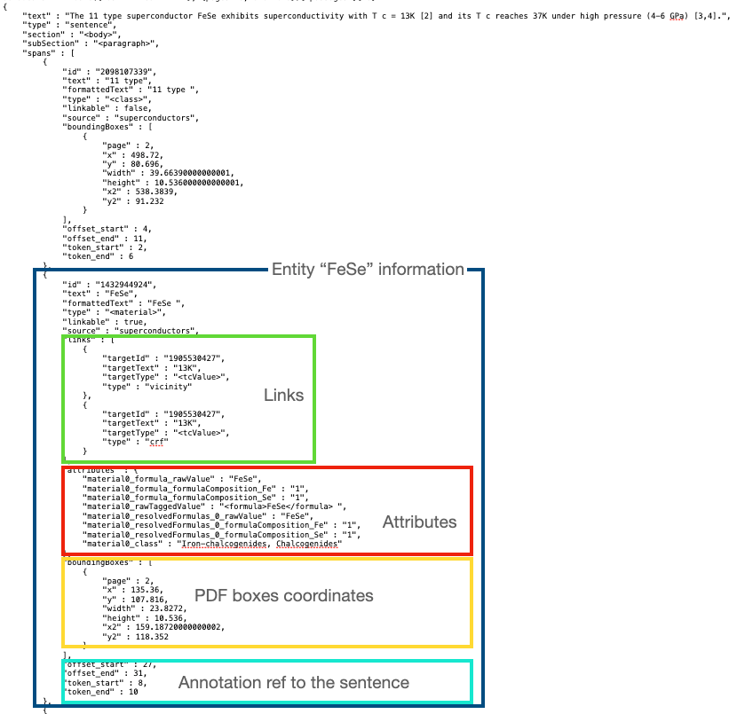
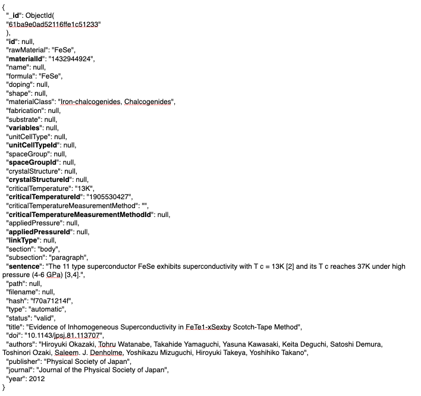
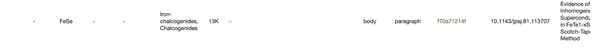
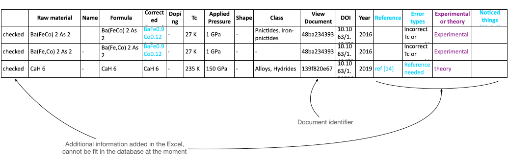
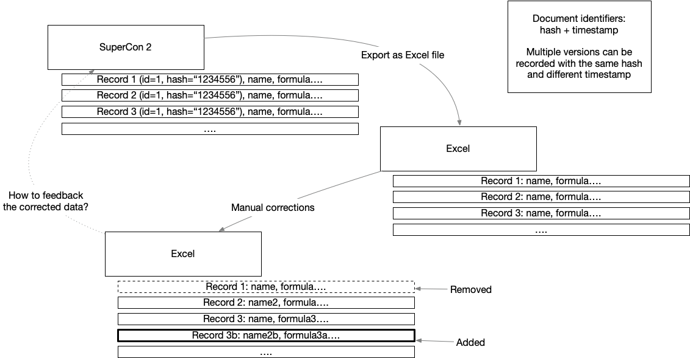

# SuperCon 2 data workflows

This is a living document describing the current SuperCon 2 worklow and documenting the proposed changes aiming to improve the efficiency and quality of the automatically extracted database. 

## Introduction

The SuperCon 2 database is currently created using a 2-steps process:

which consists in:
 - Extraction task: transformation, structuring and extraction of PDF documents into text representation (2) (JSON format, stored in a 'document' collection)
 - Aggregation task: summary of the extracted data (3) into a tabular synthetic representation (4) (JSON format, stored in a 'tabular' collection)
 - additionally, the PDFs are also stored as binary (1)

Obviously, each step is optimised and structured to best serve its purpose: 
 - (2) + (1) are used to visualise the PDF and the annotations in the same page 
 - (3) is used to show the database 

The same schema can be seen as follows, where the focus is on the data flow:

A “record”, is a row in the database table (material, properties)

## Data flow

In this section we illustrate the data flow, from the data point of view.

Let's take an example a sentence in a document (within the blue box).

The same sentence after the Extraction task, is stored as follows in the data format (2), as illustrated before. From the figure we can see that for each entity we have several information, e.g. links, attributes, coordinates within the PDF and additional information like the offsets in the sentence.

The Aggregation Task "compresses" to synthetic data, where the goal is to show the record in a tabular manner.
The various identifiers (*Id) are unique identifiers from the data format (2), e.g. material ID si the unique ID of the entities of type material.
The synthesized data become:

which is partially visualised in the next figure. 
Please notice that the attributes in bold are not visualised, nor exported to Excel.

A generic Excel output (specifically taken from the Sakai-san corrected data) looks as follows. 
**Please notice that this represents a different record, it's just an example to show that the export to Excel leads to loss/addition of certain data.**
 

In summary: 

Remarks/comments: 
- Excel does not export all the available data (current interface limitation), for example the specific record identifier is not exported. 
- Given a record in the Excel file that Sakai-san corrected, we can identify the document but there is no guaranteed we can find the actual record.
- The process of correction can be more efficient with a single interface
- the mapping between Excel and the database might require manual intervention to find the correct record (low efficiency),
- the added data do not fit in the database at the moment, 

### Manual process

At a glance: 
- Manual process possible, although very inefficient
- The process could require 2-3 weeks to be carried out
- Is not guaranteed that the process could be repeatable
- The process will be dependent on someone 
- Learning from the past: during the SuperMat construction we had two manual steps that only Luca-san could do (XML -> TSV -> Inception -> TSV -> XML). It was error prone and time consuming.-  
