# Guideline for data correction

## Table of Contents

* [Introduction](#introduction)
* [Data model](#data-model)
* [General principles](#general-principles)
    + [Units](#units)
    + [Correction workflow](#correction-workflow)
    + [Record status](#record-status)
    + [Error types](#error-types)
    + [Priority between error types](#priority-between-error-types)
    + [Annotated entities conventions](#annotated-entities-conventions)
* [Rules](#rules)
    + [Detailed description and rules for individual items](#detailed-description-and-rules-for-individual-items)
    + [Collection of Examples](#collection-of-examples)

## Introduction

This document describes the general principles and rules to follow to amend the data of the SuperCon 2 database. SuperCon 2 is a database of superconducting materials which properties are extracted automatically from scientific literature.

The guidelines assume that the user knows well the SuperCon 2 application. SuperCon 2 is intuitive and should not require specific training, the main features are illustrated in the [Readme.md](../../Readme.md).

## Data Model

This section describes the different information that are stored in the database.

### Record field description

| Items related to material | Items related to target properties | Items Related to paper | Miscellanecus |
|---------------------------|------------------------------------|------------------------|---------------|
| Raw material              | Critical Temperature               | Document               | Flag          |
| Name                      | Applied Pressure                   | DOI                    | Actions       |
| Formula                   | Method obtaining Tc                | Year                   | Link Type     |
| Doping                    |                                    | Section                | Record Status |
| Variables                 |                                    | Subsection             | Error Types   |
| Form                      |                                    | Path                   |               |
| Substrate                 |                                    | Timestamp              |               |
| Fabrication               |                                    | Authors                |               |
| Material Class            |                                    | Title                  |               |
| Unit cell type            |                                    | Publisher              |               |
| Space Group               |                                    | Journal                |               |
| Structure type            |                                    | Filename               |               |

## General principles

In this section, we illustrate the general principles that are applied to the guidelines. Both "Record status" and "Error types" are be covered in [Rules](#rules) with examples and illustrations.

### Units

As a general rule the Units are kept in the data. Although GPa and K are the most common units for `applied pressure` and `superconducting critical temperature`, there are still several cases of valid papers mentioning other units, e.g., `kbar` or `MPa`.

### Correction workflow

Each records contains two main internal properties:

- status, indicate the state of the record. More information [here](#record-status),
- type, indicate whether the record was modified manually or automatically

### Record status

| Status    | Description                                                                                                                    |
|-----------|--------------------------------------------------------------------------------------------------------------------------------|
| new       | Default status when a new record is created.                                                                                   |
| curated   | The record has been updated by a human.                                                                                        |
| validated | The record was validated by a human.                                                                                           |
| invalid   | The record is wrong or inappropriate for the situation (e.g., Tm or Tcurie extracted as superconducting critical temperature). |
| obsolete  | Assigned to a record when it is modified, triggering the creation of a new record (internal status, not visible to users).     |
| deleted   | The record has been removed by a curator (internal status, not visible to users).                                              |

Table 1: A record can be marked with four status type. 

### Error types

The extraction of superconductors materials is performed, following a unified data flow. Failures can occur at each stage in the flow, and we distinguish each failure by naming them "error type". Error types indicate the causes for which a specific material-properties record is invalid, wrong or missing. Table 2 illustrates these type of errors:

| Name                   | Description                                                                                                                                 |
|------------------------|---------------------------------------------------------------------------------------------------------------------------------------------|
| From table             | The entities Material → Tc → Pressure are identified in a table. At the moment, table extraction is not performed.                          |
| Extraction             | The material, temperature, pressure are not extracted (no box) or extracted incorrectly.                                                    |
| Linking                | The material is incorrectly linked to the Tc given that the entities are correctly recognized.                                              |
| Tc classification      | The temperature is not correctly classified as "superconductors critical temperature" (e.g., Curie temperature, Magnetic temperature...).   |
| Composition resolution | The exact composition cannot be resolved (e.g., the stoichiometric values cannot be resolved).                                              |
| Value resolution       | The extracted formula contains variables that cannot be resolved, even after having read the paper. This includes when data is from tables. |
| Anomaly detection      | The data is automatically modified by the anomaly detection script.                                                                         |
| Curation amend         | The curator is updating the data which does not present issues due to the automatic system.                                                 |

Table 2: List of error types, sorted by their occurrence in the data flow. 

### Priority between error types

Some errors can occur in specific part of the process, shown below:
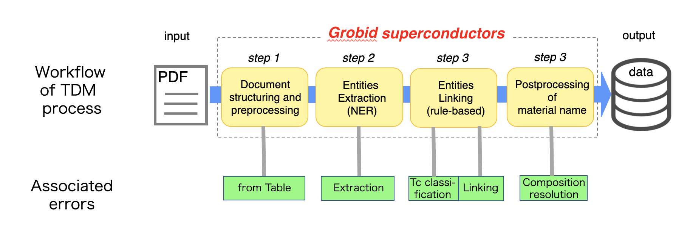

Following the dataflow, the priority between certain errors is as follows:

From table > Extraction > Tc classification > Linking > Composition resolution

For example, when a wrong formula (Extraction) is linked incorrectly (Linking) to Curie temperature (Tc classification), the error is "Extraction".

### Annotated entities conventions

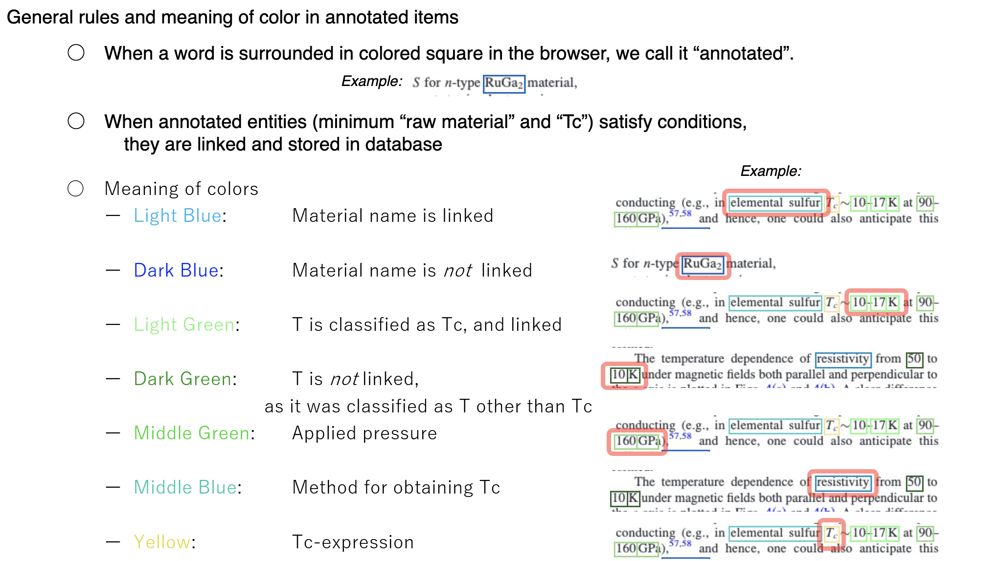

## Rules

There are two types of actions that a curator can do when checking the data:

1. Data reporting or flagging
2. Data correction

The (1) data reporting (or flagging) is the process in which a record is marked as "possibly invalid". The term "flag" indicates the action of adding a flag on top of a record. In this case, the record will be hidden from the public view of the database. In addition, curators could select only reported records and inspect them thoughtfully, amending or removing for good (2).

### Detailed description and rules for individual items

#### Items related to material

- Raw material
    - Description & typical example:

      The extracted material name as it is

      For example: "tetragonal Ba(Fe_1-x_Co_x_)_2_As_2_ grown on Si(111)"
    - Curation rule:

      We do not curate this item because is the way originally the record is extracted from the document

- Name
    - Description & typical example:

      Abbreviation/acronym of a material, for example: "LSCO"

    - Curation rule:

      Try to fill it up when it is available in the text or context

    - Possible error and examples:
      N/A

- Formula
    - Description & typical example:

      Chemical formula of the material

      For example: La_1.75_Sr_0.25_CuO_4_
    - Curation rule:

      What we want is chemical formula, that ONLY consists of atomic species and numbers. Therefore;

        - When the value for $x$ in the formula can be found in the same document, try to fill it.
        - When any additional information regarding the materials remains attached (e.g. tetragonal, annealed, grown on substrate), split and put them in appropriate sections.

    - Possible error and examples :

        - Wrong - Extraction

          example1: extracted formula is only a part of it

          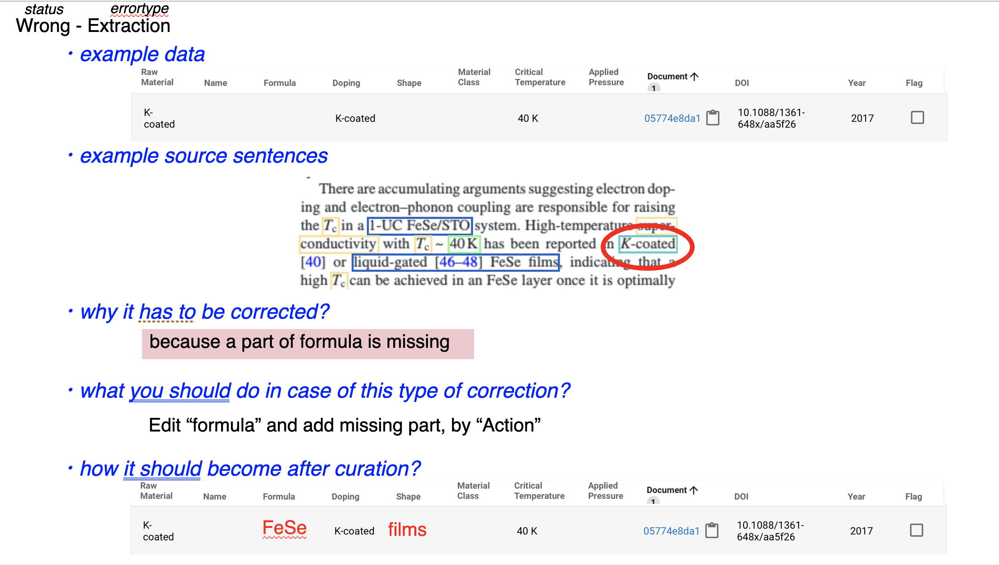

        - Wrong - Composition resolution:

            <!-- [example1: formula is not complete](https://nimsgojp-my.sharepoint.com/:p:/r/personal/foppiano_luca_nims_go_jp/Documents/%E6%B7%BB%E4%BB%98%E3%83%95%E3%82%A1%E3%82%A4%E3%83%AB/Supercon2-curation-guidelines.pptx?d=wf1ec5f0bc719422591814d1be2795051&csf=1&web=1&e=mkpGZj&nav=eyJzSWQiOjI1NiwiY0lkIjoyNjAxMjI0MDU1fQ{:target="_blank"}) -->

          example1: variable in formula remained unsubstituted

          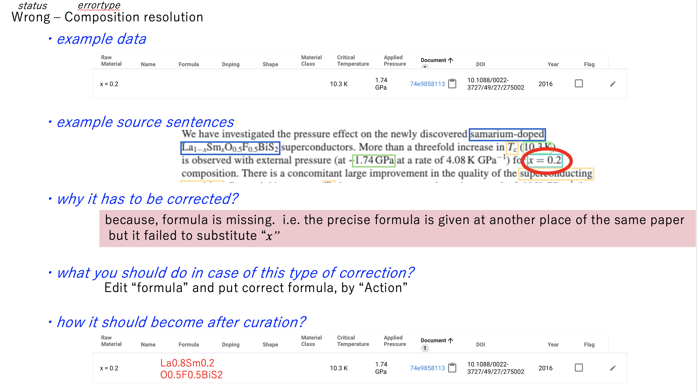

          example2: formula has extra

          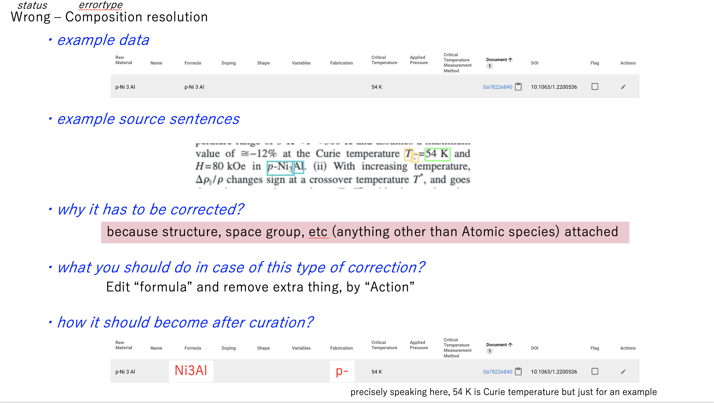

        - Invalid - Extraction

          Example1: extracted something else than formula
          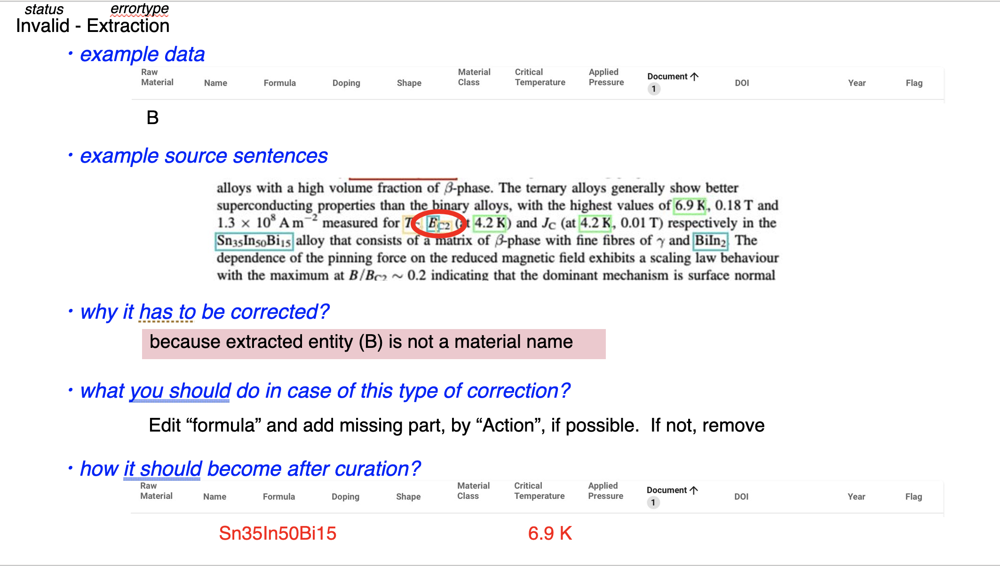

        - Missing - Extraction

          example1: formula is not annotated
          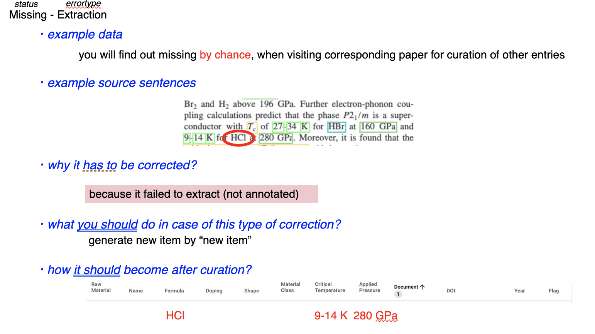

- Doping
    - Description & typical example:

      Atoms and molecules that are used for doping, adjointed to the material name

      For example: _Ag_-doped Bi_2_Te_3_
    - Curation rule:

      Try to fill when it is available
    - Possible error and examples :

- Variables
    - Description & typical example:

      Variables that can be substituted in the formula
    - Curation rule:

      This is often kept unfilled, due to "composition resolution" error. Try to fill it when curator finds it in the paper.
    - Possible error and examples :

- Form
    - Description & typical example:

      Identify the form of the material

      For example: "poly crystals", thin film, wire
    - Curation rule:

      Try to fill when it is available

    - Possible error and examples

- Substrate
    - Description & typical example:

      Substrate on which target material is grown

      For example: Cu grown on _Si(111)_ substrate

    - Curation rule:

      Try to fill when it is available

    - Possible error and examples

- Fabrication
    - Description & typical example:

      Represent all the various information that are not belonging to any of the previous tags

      For example: annealed, irradiated

    - Curation rule:

      Try to fill when it is available

    - Possible error and examples

- Material Class
    - Description & typical example:

      For the time being, class name is given by rule-based approach, based on containing either anion or cation atoms.

      For example: Fe-based

    - Curation rule:

      We do not curate this item
    - Possible error and examples

- Unit Cell Type
    - Description & typical example:

      Bravais lattice that the crystal structure of the material belongs to

      For example: tetragonal, orthorhombic

    - Curation rule:

      Try to fill whenever available
    - Possible error and examples

        - Wrong - Composition resolution

          Example1: formula has extra
          

- Space Group
    - Description & typical example:

      Space group for which the material's crystal structure belongs to. Either No. (1-230) or "standard short symbol" is fine.

      For example: "Space group No. 225 (Fm-3m)"
    - Curation rule:

      try to fill whenever available
    - Possible error and examples
        - Wrong - Composition resolution

          Example1: formula has extra
          

- Structure type
    - Description & typical example:

      Type of crystal structure, described by the name of typical material that takes the crystal structure.

      For example: MnP-type, AlB_2_-type
    - Curation rule:

      Try to fill whenever available
    - Possible error and examples

#### Items related to the target property

- Critical Temperature

    - Description & typical example:

      Represent the value of the superconducting critical temperature, Tc. Other temperatures (fabrication conditions, etc.) should not be extracted.

      For example: 100 K

    - Curation rule:

      It has to be properly linked with composition and applied pressure(if it exists)
    - Possible error and examples :
        - Invalid - From table

          Example1: entity is from table
          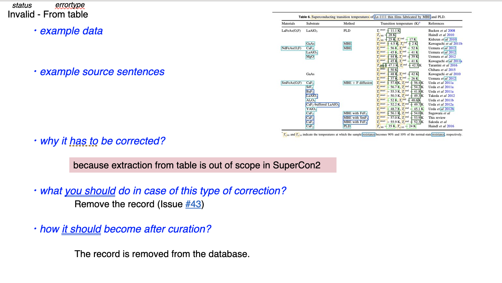

        - Invalid - Tc classification

          Example1: extracted T is not superconducting transition temperature
          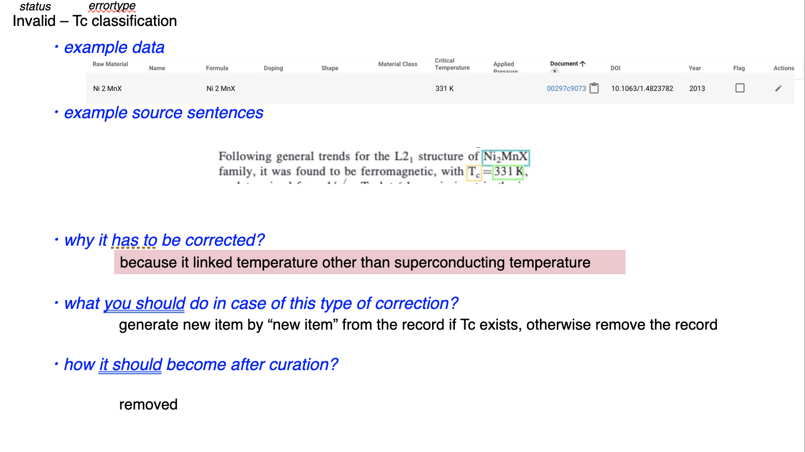

        - Missing - Tc classification

          Example1: Superconducting transition temperature was annotated but classified as other than SC
          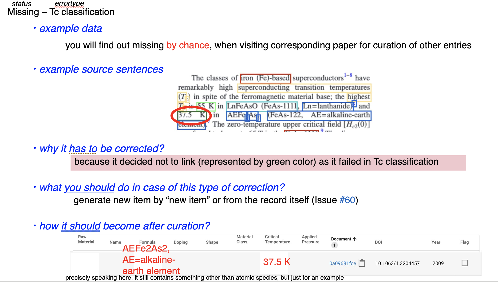

        - Wrong - Linking

          Example1: Link among material - Tc_value - Presssure_value was not correct
          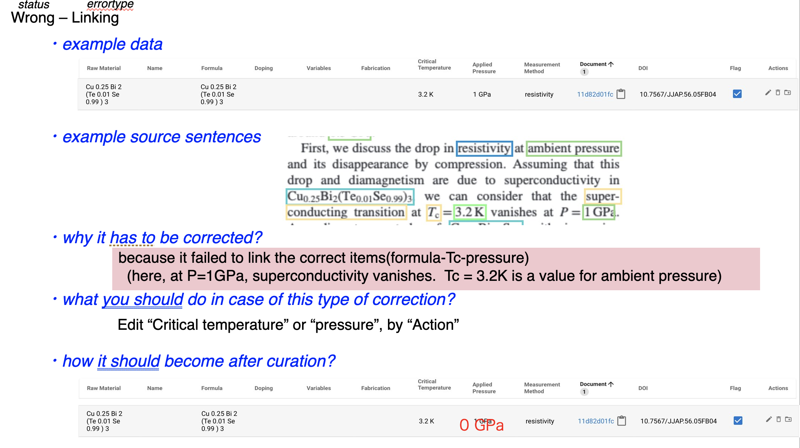

        - Missing - Linking Example1: Tc_value was annotated but failed to link to material
          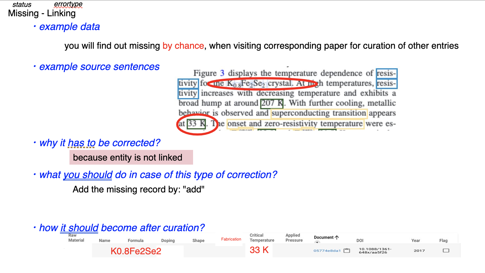

- Applied Pressure

    - Description & typical example:

      Represent the value of applied pressure on which superconducting critical temperature Tc is determined. Other pressures (pressure during fabrication process, etc.) should not be extracted.

      For example: 10 GPa
    - Curation rule:

    - Possible error and examples :
        - Extraction

        - Tc classification

        - Wrong - Linking

          Example1: Link among material - Tc_value - Presssure_value was not correct
          

- Method Obtaining Tc

    - Description & typical example:

      Indicates the techniques used to determine the superconductiving transition temperature, either by experimental measurements or theoretical calculations. This includes also explanatory sentences for temperature dependence of resistivity, magnetic susceptibility or specific heat graphs, not necessarily related to superconductivity.

      For example: resistivity, magnetic susceptibility, specific heat, calculated
    - Curation rule:

      Try to fill whenever available
    - Possible error and examples

#### Items related to the paper

- DOI

  Digital Object Identifier of the paper where the entity is extracted

- Year

  Published year of the paper where the entity is extracted

- Section

  Indicate from which of the main sections of the paper (header, body, annex) the record has been extracted

- Subsection

  Indicate the portion of the section from which the record has been extracted:
    - header: title, abstract, keyword
    - body: paragraph, figureCaption, tableCaption
    - annex: paragraph

- Timestamp

  Latest timestamp on which the record was modified

- Authors

  Authors' names of the paper where the entity is extracted

- Title

  Title of the paper where the entity is extracted

- Publisher

  Publisher's name of the paper where the entity is extracted

- Journal

  Journal's name where the entity is extracted

- Filename

- The original file name of the PDF document

#### Miscellaneous

- Flag

  Flag a record as invalid or validated

- Actions

  Actions that can be performed on a specific record (edit, remove, validate, etc.)

- Link Type

  The algorithm used to link the two entities

- Record Status

  Described in the ["General principles" section](#general-principles)

- Error Types

  Described in the ["General principles" section](#general-principles)

### Collection of examples

When it is not obvious which state-errortype is appropriate, examples below might help curator to decide.

examples of state-errortypes:

- Invalid - from_table

  

- Wrong - Extraction

  

- Invalid - Extraction

  

- Missing - Extraction

  

- Invalid - Tc_classification

  

- Missing - Tc_classification

  

- Wrong - Linking

  

- Missing - Linking

  

- Wrong - Composition resolution

  
  

- multiple errors in vicinity

  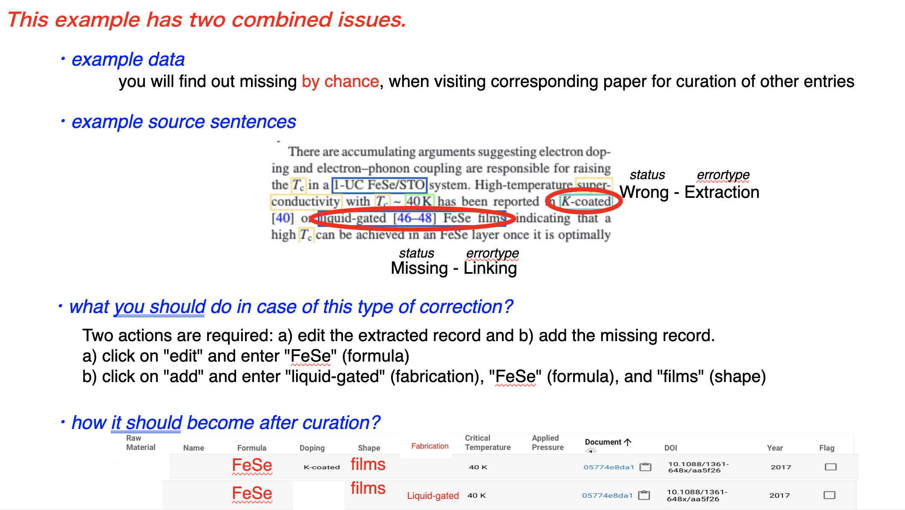

#### Missing entity

In the following example the entity has been missed completely. In this case the cause is likely "Extraction" because the process failed to recognise `HCl`. 

Figure 1: Example of missing entity. 

#### Invalid temperature 
In the following example the temperature of about 1234 K has been extracted. This case is likely a problem of Tc classification because the temperature should not have classified as `superconductor critical temperature` and therefore not linked. 

Figure 2: Example of invalid extracted temperature. 

#### Composition extraction 
[LF] This specific case should be clarified [Ref](https://github.com/lfoppiano/supercon2/issues/71#issuecomment-1098751198)

Figure 3: Example 

