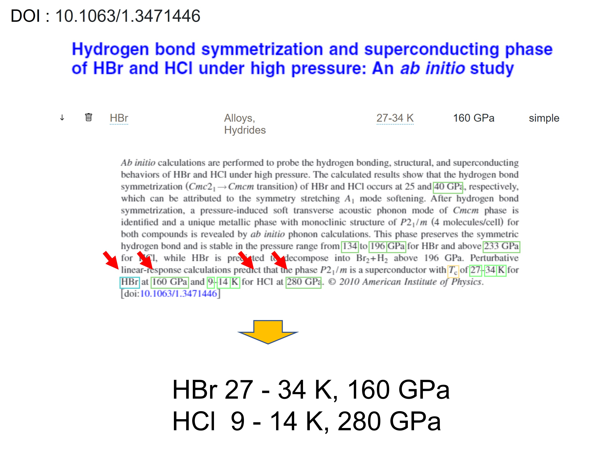
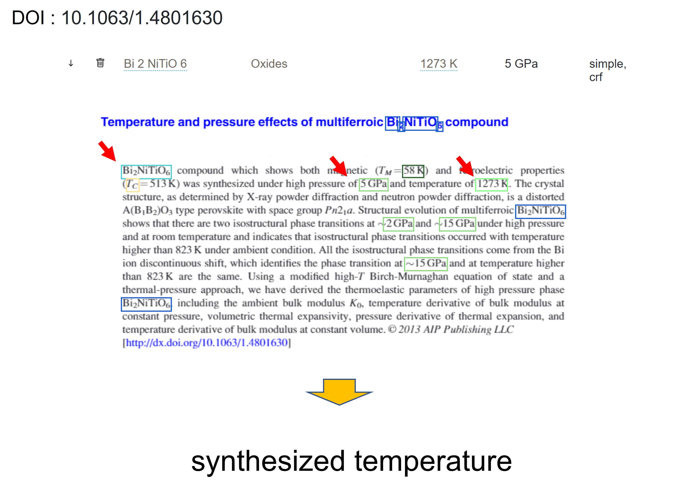
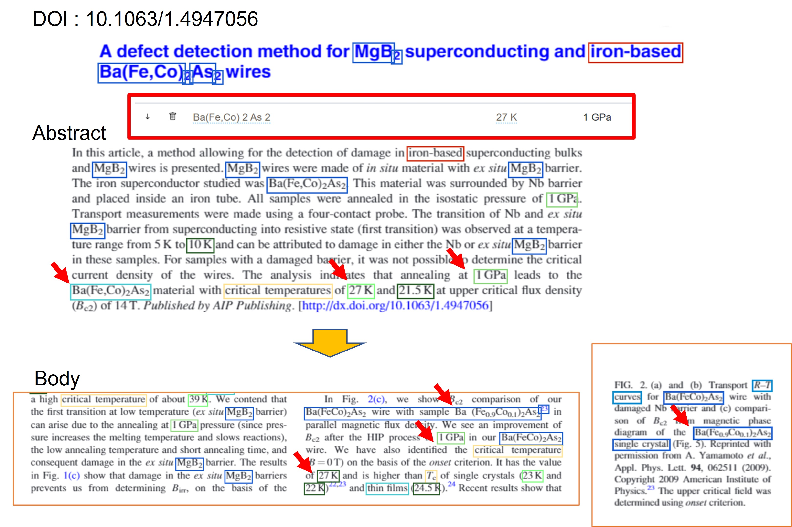

# Guideline for data correction

## Table of Contents

* [Introduction](#introduction)
* [Data model](#data-model)
* [General principles](#general-principles)
   + [Units](#units)
   + [Record status](#record-status)
   + [Error types](#error-types)
* [Rules](#rules)
* [Error types](#error-types)
* [Glossary](#glossary)

## Introduction

This document describes the general principles and rules to follow to amend the data of the Supercon 2 database. 
SuperCon 2 is a database of superconducting materials which properties are extracted automatically from scientific literature.

The guidelines assume that the user knows well the SuperCon 2 application. The documentation on how to use SuperCon 2 is in ...

## Data Model 

This section describes the different information that is stored in the database. 

## General principles

In this section, we illustrate the general principles that are applied to the guidelines. 
Both "Record status" and "Error types" will be covered in [Rules](#rules) with examples and illustration.

### Units

As a general rule the Units are kept in the data. Although GPa and K are the most common units for `applied pressure` and `superconducting critical temperature`, there are still several cases of valid papers mentioning other units, e.g., `kbar` or `MPa`. 

### Record status

These are concepts. Add the status flow. 

| Status  | Definition                                                                     |
|---------|--------------------------------------------------------------------------------|
| correct | when the record (extracted data and linking) is correct                        |
| wrong   | when some aspects of the records are incorrect                                 |
| invalid | when the record is not a SC record and it should be removed from the database  |
| missing | if the record was not extracted                                                |

Table 1: A record can be marked with four status type. 

### Error types

The extraction of superconductors materials follows a precise data flow. 
However, failures can occur at any time in the flow and it is important to know at which point they occur.
In other words, the error type indicates the causes for which a specific material-properties record is invalid, wrong or missing.
Table 2 illustrates these type of errors:

| Error type             | Definition                                                                                                                                                                                                |
|------------------------|-----------------------------------------------------------------------------------------------------------------------------------------------------------------------------------------------------------|
| From table             | When part of complete tables are incorrectly extracted, and consequently entities contained within. At the moment, table extraction is not performed.                                                      |
| Extraction             | The entity is not extracted or its boundaries are not matching the correct information (e.g., when the entity is partially extracted or when the extraction includes text that is not part of the entity. |
| Tc classification      | The temperature is not correctly classified as "superconductors critical temperature" (e.g. Curie temperature, Magnetic temperature…)                                                                     |
| Linking                | The material is incorrectly linked to the Tc given that the entities are correctly recognised                                                                                                             |
| Composition resolution | When the exact composition cannot be resolved (e.g. the stochiometric values cannot be resolved)                                                                                                          |

Table 2: List of error types, sorted by their occurrence in the data flow. 

## Rules

There are two types of actions that a curator can do when checking the data:  

1. Data reporting or flagging
2. Data correction

The (1) data reporting (or flagging) is the process in which a record is marked as "possibly invalid". 
The term "flag" indicates the action of adding a flag on top of a record. In this case, the record will be hidden from the public view of the database. 
In addition, curators could select only reported records and inspect them thoughtfully, amending or removing for good (2). 

### Examples

#### Missing entity

In the following example the entity has been missed completely. In this case the cause is likely "Extraction" because the process failed to recognise `HCl`. 

Figure 1: Example of missing entity. 

#### Invalid temperature 
In the following example the temperature of about 1234 K has been extracted. This case is likely a problem of Tc classification because the temperature should not have classified as `superconductor critical temperature` and therefore not linked. 

Figure 2: Example of invalid extracted temperature. 

#### Composition extraction 
[LF] This specific case should be clarified [Ref](https://github.com/lfoppiano/supercon2/issues/71#issuecomment-1098751198)

Figure 3: Example 

## Glossary

This section describes the domain-specific words that are used in this document. 

| Concept    | Definition |
|------------|------------|
| SuperCon   |            |
| SuperCon 2 |            |
| Status     |            |
| Error type |            |
