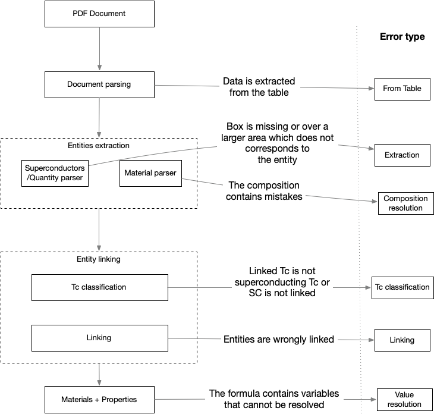
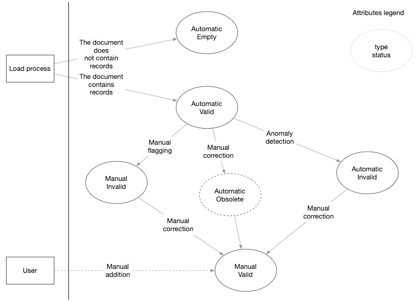

# Technical documentation

## Error types

The error types or causes for which the material-properties record is incorrect.

They answer to the question: "What was the cause?"

| Name                   | Description                                                                                                                                                                                           |
|------------------------|-------------------------------------------------------------------------------------------------------------------------------------------------------------------------------------------------------|
| From table             | The entities Material -> Tc -> Pressure is identified in a table. At the moment table extraction is not performed.                                                                                    |
| Extraction             | The material, temperature, pressure is not extracted (no box) or extracted incorrectly.                                                                                                               |                                                      
| Linking                | The material is incorrectly linked to the Tc given that the entities are correctly recognised                                                                                                         |                                                   
| Tc classification      | The temperature is not correctly classified as "superconductors critical temperature" (e.g. Curie temperature, Magnetic temperature…)                                                                 | 
| Composition resolution | The exact composition cannot be resolved (e.g. the stochiometric values cannot be resolved)                                                                                                           |
| Value resolution       | The extracted formula contains variables that cannot be resolved, even after having read the paper. This includes when data is from tables. [#125](https://github.com/lfoppiano/supercon2/issues/125) | 

## Workflow status flags

The workflows flags are properties within the database that are used to mark different status of the data:
 - `type` indicate the type of operation that was performed
 - `status` indicate the status of the current record

and their value is used as follows:

| Name   | Values              | Description                                                                                                                                         |
|--------|---------------------|-----------------------------------------------------------------------------------------------------------------------------------------------------|
| type   | manual              | The performed operation was manual                                                                                                                  |
| type   | automatic           | The performed operation was automatic (anomaly detection, loading script)                                                                           |
| status | valid               | The record is valid (if `type=automatic`, might still be wrong)                                                                                     |
| status | invalid             | The record is invalid, incorrect (the certanly depends on the `type` value                                                                          |
| status | obsolete            | The record is obsolete, a new record supersedes it and the new record will point to the old (if we assume that a correction will create new record) |
| status | empty               | The record does not contains any information (when the document does not have any link)                                                             |

However, the flags should be used in pair and the state change is illustrate as follows: 

